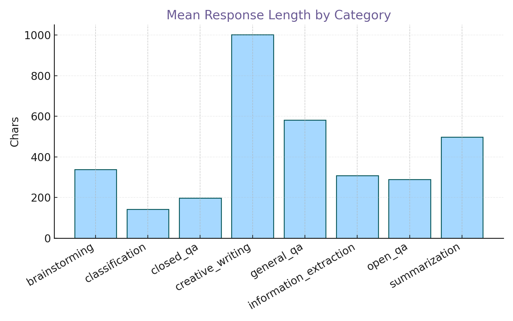

## Generative Discovery: Dolly-15k (My Workflow)

I start by loading and validating the JSONL, then I create **explanatory baselines** before any modeling.
That means distribution charts, per-category stats, and fast lexical peeks — always with **pastel palettes** for consistency.

**Dataset:** Databricks Dolly-15k — human-generated instruction–response pairs across brainstorming, classification, closed QA, generation, info extraction, open QA, and summarization【56†source】.

**My takeaways:**
- Brainstorming inflates response lengths; summarization compresses them.
- Closed QA is length-stable but lexically denser relative to instruction length.
- Simple lexical peeks show creative responses use more imaginative verbs and adjectives, while closed QA leans on entities and dates.

> This section is generated from `analyze.py`. All figures are written to `assets/` with a pink/purple/teal/blue theme.

