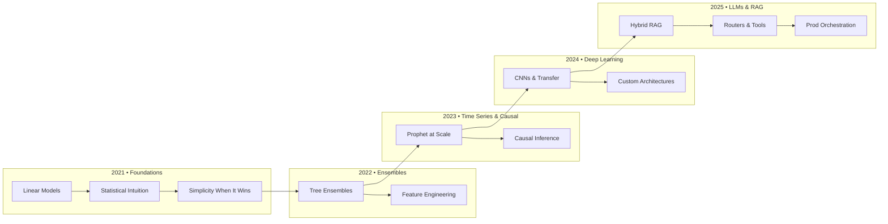
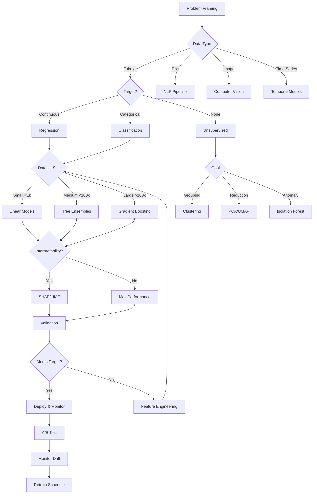
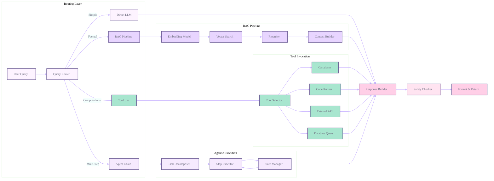

# PearlMind-ML-Journey
Built with dedication to the craft of machine learning

<div align="center">


<br/><br/>

<!-- Core stack badges -->


<br/><br/>

<!-- Dynamic Status (update slug if your repo name differs) -->


<br/><br/>

<kbd><a href="https://github.com/Cazzy-Aporbo/Cazzy-Aporbo/">Profile</a></kbd> • <kbd><a href="#model-atlas-mathematical-foundations--production-insights">Models</a></kbd> • <kbd><a href="#the-prompt-ladder-beginner--expert">Prompts</a></kbd> • <kbd><a href="#bias--responsible-ai-checklist">Ethics</a></kbd> • <kbd><a href="#mathematical-intuitions--humor">Math</a></kbd>

</div>

<br/>


## Why This Exists: The Quest for Ethical Superintelligence

As a data scientist deeply fascinated by the emergence of superintelligence, I believe the path forward requires not just technical excellence but profound ethical grounding. This repository chronicles my journey from statistical foundations to advanced AI systems, guided by the principle that powerful intelligence must be aligned with human values.

The transition from narrow AI to general intelligence will not come from brute force alone. It rests on sound mathematics, careful system design, and the discipline to ship interpretable, controllable, and beneficial models. Every project here reflects ablation studies, fairness audits, and production constraints.

<div align="center">

</div>

---

## Mathematical Intuitions & Humor

Throughout this journey, humor helps crystallize concepts.

```
Training Accuracy → 1, Test Accuracy → 0
```

(Life’s purest overfit.)

```
Happiness = 1/Bias + 1/Variance
```

(You cannot minimize both.)

```
Love(t+1) = Love(t) - η·∇Arguments
```

(Gradient steps toward fewer conflicts.)

These encode truths about overfitting, the bias–variance tradeoff, and optimization landscapes.

---

## Model Atlas: Mathematical Foundations & Production Insights

<div align="center">

</div>

Understanding models means grasping both their theoretical core and production behavior. Below are practical notes you can rely on when choosing, explaining, and shipping.

### Linear Models: The Foundation of Interpretable AI

Linear regression aims to solve β\* = (XᵀX)⁻¹Xᵀy. Multicollinearity breaks invertibility; ridge fixes it via β\* = (XᵀX + λI)⁻¹Xᵀy. Logistic regression models log-odds with cross-entropy loss, solved by iterative optimization.

Production strengths

1. Microsecond-class inference; 2) Memory efficiency; 3) Direct interpretability; 4) Easy online learning via SGD; 5) Good calibration.

Advanced moves
Elastic Net for sparsity + grouping; basis expansions (polynomials, splines, Fourier) to keep linear-in-parameters while capturing nonlinearity.

### Support Vector Machines: Geometry Meets Optimization

Primal: minimize ½‖w‖² with yᵢ(w·xᵢ + b) ≥ 1. Dual with KKT yields sparsity in support vectors. Kernels (polynomial, RBF) make nonlinear decision boundaries tractable without explicit feature maps. Soft margins balance margin width vs training error via C. SMO and approximations (Nyström, random Fourier features) unlock scale.

### Tree Ensembles: Where Weak Learners Become Strong

Decision trees split by impurity (Gini/entropy). Ensembles fix bias–variance.

Random Forests: bagging + feature subsampling reduce variance; OOB gives free CV; beware high-cardinality bias in impurity importances.

Gradient Boosting (XGBoost/LightGBM/CatBoost): stagewise additive modeling, second-order optimization (XGB), GOSS and EFB (LGBM), ordered target encoding to prevent leakage (CatBoost). Early stopping is essential.

### Deep Learning: Universal Function Approximation

Networks as compositions of affine transforms and nonlinearities; backprop applies the chain rule efficiently. Vanishing/exploding gradients motivate ReLU, residuals, normalization. BatchNorm stabilizes training. Attention focuses computation; the lottery-ticket hypothesis hints at sparse winning subnets. Generalization benefits from implicit regularization, overparameterization regimes, and hierarchical representations.

### Large Language Models: The Emergence of Intelligence

Transformers replace recurrence with attention; positional encodings inject order. Scaling laws predict loss improvements; emergent abilities appear at scale. In-context learning suggests algorithmic behavior internal to attention. RLHF and constitutional methods align behavior; mechanistic interpretability studies circuits like induction heads. Deployment needs quantization, distillation, and retrieval grounding to reduce hallucinations.

---

## Relational Diagrams

### Learning Journey



### Model Selection Flow 



### RAG + Router Hybrid Pipeline



---

## The Prompt Ladder (Beginner → Expert)

<div align="center">

</div>

A set of prompts I actually use, progressing from interpretation to system stewardship.

### Rung 1: Building Intuition

```
Given model prediction [PREDICTION] for input [FEATURES]:

Mathematical Decomposition
1) Linear contributions Σ(βᵢ·xᵢ) with ranks
2) Interaction effects (top pairs) and intuition
3) Nonlinear transforms used (polys/splines/kernels)
4) Uncertainty: 95% CI + aleatory vs epistemic

Business Translation
- Map coefficients to business impact
- Controllable vs uncontrollable factors
- Counterfactuals to reach [TARGET]
- Sensitivity (∂prediction/∂feature) and break-even
- Assumption checks (residuals, Q–Q)
```

### Rung 2: Error Archaeology

```
Systematic Failure Analysis for [MODEL]

Uncertainty Types
- Aleatory: noise, randomness, ensemble spread
- Epistemic: sparse regions, OOD, NN distance
- Approximation: capacity limits, residual patterns

Failure Mining
- Cluster errors (DBSCAN/HDBSCAN)
- Subgroup discovery (WRAcc/lift)
- Temporal drift (seasonality, CUSUM)
- Adversarial probes

Root Causes
- Shift metrics: KL, Wasserstein, MMD
- Label issues: confident errors, agreement
- Feature gaps: interactions, nonlinearity
- Causal confounding, selection, measurement bias
```

### Rung 4: Hybrid Decisions (Routers)

```
Design routing for:
- Fast: latency=[X]ms, acc=[Y]%, cost=$[Z]
- Accurate: latency=[A]ms, acc=[B]%, cost=$[C]
- Specialists: [DOMAINS]

Constraints
- P50 < [L1]ms, P99 < [L2]ms
- Budget: $[BUDGET]/1M requests
- Min accuracy: [MIN_ACC]%

Policy
1) Calibrated confidence thresholds
2) Complexity scoring (length/vocab/structure)
3) Dynamic batching; early-exit cascade
4) Failover + monitoring SLO dashboards

Output: decision tree, thresholds, expected metrics.
```

### Rung 5: Production Stewardship

```
Requirements
- Scale: [QPS], Storage: [TB]
- SLA: [UPTIME]%, P99: [LATENCY]ms
- Compliance: [GDPR/CCPA/...]
Training
- Data versioning (DVC), feature store
- Tracking (MLflow/W&B), distributed training
Serving
- Registry, canary/A-B, batch vs real-time features
- Cache by query pattern
Monitoring
- Drift (PSI/KS/MMD), reliability (ECE/Brier)
- System: latency percentiles, errors, throughput
Rollbacks
- Auto thresholds + manual incident triggers
Auditability
- Lineage, decision logs, explainability API
- Multi-region rollout, shadow testing, cost controls
```

---

## Quick Model Decision Guide

| Task / Data                       | Recommended Models             | Why it works                                | Common pitfalls                                |
| --------------------------------- | ------------------------------ | ------------------------------------------- | ---------------------------------------------- |
| Tabular (mixed types, <100k rows) | LightGBM / CatBoost            | Handles categoricals, fast, strong defaults | Target leakage, overfitting without early stop |
| Tabular (wide p≫n)                | Logistic/Linear + Elastic Net  | Sparse and grouped solutions                | Scale/standardize, watch collinearity          |
| Unsupervised segmentation         | K-Means / GMM / DBSCAN         | Speed / probs / arbitrary shapes            | K selection, eps/minPts sensitivity            |
| Forecasting (business, holidays)  | Prophet / SARIMA               | Changepoints, seasonality, intervals        | Multi-seasonality tuning, data hygiene         |
| Images                            | Transfer learning (ResNet/ViT) | Pretrained features, rapid convergence      | Overfit small data, require augmentation       |
| Text                              | Transformers (HF) + RAG        | Context length + grounding                  | Retrieval chunking, latency, eval complexity   |
| Hybrid QA / dynamic knowledge     | RAG + reranker + LLM           | Fresh knowledge, citations, reduced halluc. | Retriever quality bottleneck                   |

---

## Bias & Responsible AI Checklist

<div align="center">  </div> <table> <tr><th bgcolor="#FFCFE7" align="center">Problem Definition</th></tr> <tr><td>
 Stakeholders identified (including impacted groups)
 Success metrics include fairness, not just accuracy
 Risks and mitigations documented
 Non-ML alternatives considered
</td></tr> </table> <table> <tr><th bgcolor="#F6EAFE" align="center">Data & Provenance</th></tr> <tr><td>
 Collection process and biases documented
 Representation gaps identified
 Label quality and agreement checked
 Privacy preserved; PII handled appropriately
</td></tr> </table> <table> <tr><th bgcolor="#A8E6CF" align="center">Training & Evaluation</th></tr> <tr><td>
 Leakage-safe splits; groups present in all splits
 Metrics per demographic and intersections
 Temporal validation mirrors deployment
 Power analysis for key decisions
:chart_with_upwards_trend: Note: validate fairness before celebrating accuracy.
</td></tr> </table> <table> <tr><th bgcolor="#FFE4F1" align="center">Subgroup Performance</th></tr> <tr><td>
 Confusion matrices per group
 Worst-group metrics highlighted
 Significance tests with corrections
 Confidence intervals for small groups
</td></tr> </table> <table> <tr><th bgcolor="#E8D5FF" align="center">Calibration & Reliability</th></tr> <tr><td>
 Reliability plots per group
 ECE / Brier scores reported
 Over/under-confidence patterns documented
</td></tr> </table> <table> <tr><th bgcolor="#FFCFE7" align="center">Interventions</th></tr> <tr><td>
 Pre: Reweighting / augmentation
 In: Constraints / adversarial debiasing
 Post: Thresholds / recalibration
 Trade-offs made explicit
</td></tr> </table> <table> <tr><th bgcolor="#F6EAFE" align="center">Human-in-the-Loop (HITL)</th></tr> <tr><td>
 Escalation paths for edge cases
 Human review for high-stakes outputs
 UI avoids automation bias
 Feedback closes the loop
</td></tr> </table> <table> <tr><th bgcolor="#A8E6CF" align="center">Monitoring</th></tr> <tr><td>
 Fairness metrics in production dashboards
 Alerts on subgroup degradation
 Regular audits scheduled
 User feedback with SLAs
</td></tr> </table> <table> <tr><th bgcolor="#FFE4F1" align="center">Audit Trail</th></tr> <tr><td>
 Model / data / config versioning
 Decision logs retained
 Explainability API for challenges
 Model and dataset cards maintained
</td></tr> </table> <div align="center">  </div>
---

## Prebuilt Tooling & Official References

* Scikit-learn — [https://scikit-learn.org](https://scikit-learn.org)
* XGBoost — [https://xgboost.ai](https://xgboost.ai)
* LightGBM — [https://lightgbm.readthedocs.io](https://lightgbm.readthedocs.io)
* CatBoost — [https://catboost.ai](https://catboost.ai)
* Statsmodels — [https://www.statsmodels.org](https://www.statsmodels.org)
* Prophet — [https://facebook.github.io/prophet/](https://facebook.github.io/prophet/)
* PyTorch — [https://pytorch.org](https://pytorch.org)
* TensorFlow/Keras — [https://www.tensorflow.org](https://www.tensorflow.org)
* Hugging Face Transformers — [https://huggingface.co/docs/transformers](https://huggingface.co/docs/transformers)
* FAISS — [https://github.com/facebookresearch/faiss](https://github.com/facebookresearch/faiss)
* LangChain — [https://python.langchain.com](https://python.langchain.com)
* Haystack — [https://docs.haystack.deepset.ai](https://docs.haystack.deepset.ai)
* ONNX — [https://onnx.ai](https://onnx.ai)
* OpenVINO — [https://docs.openvino.ai](https://docs.openvino.ai)

---

## Project Structure

```
PearlMind-ML-Journey/
├── assets/                 # GIF/SVG/Lottie animations, banners
├── data/                   # raw/processed/features/cache
├── models/                 # baseline/experiments/production/registry
├── notebooks/              # exploration/modeling/evaluation/reports
├── src/
│   ├── data/{loaders,processors,validators,splitters}.py
│   ├── features/{extractors,transformers,store}.py
│   ├── models/{baseline,ensemble,neural,hybrid}.py
│   ├── evaluation/{metrics,fairness,calibration,monitoring}.py
│   ├── deployment/{serving,preprocessing,postprocessing,monitoring}.py
│   └── utils/{config,logging,profiling,visualization}.py
├── tests/{unit,integration,inference,fixtures}
├── configs/{model_configs,feature_configs,deployment_configs,monitoring_configs}
├── scripts/{train.py,evaluate.py,deploy.py,monitor.py}
├── docs/{model_cards,api,guides,decisions}
├── .github/workflows/{ci.yml,cd.yml,monitoring.yml}
├── requirements/{base.txt,dev.txt,test.txt,prod.txt}
├── Dockerfile
├── Makefile
├── pyproject.toml
└── README.md
```

---

## Quickstart

```bash
python -m venv .venv && source .venv/bin/activate
pip install --upgrade pip
pip install -r requirements/base.txt
jupyter lab
```

### Optional: Pastel matplotlib theme for notebooks

```python
import matplotlib as mpl

palette = {
    "blossom": "#FFCFE7",
    "lilac":   "#F6EAFE",
    "lavender":"#6B5B95",
    "mint":    "#A8E6CF",
    "fog":     "#FDF3FF",
    "dusk":    "#6E6E80",
}
mpl.rcParams.update({
    "figure.facecolor": palette["fog"],
    "axes.facecolor":   palette["fog"],
    "axes.edgecolor":   palette["dusk"],
    "axes.labelcolor":  palette["dusk"],
    "xtick.color":      palette["dusk"],
    "ytick.color":      palette["dusk"],
    "grid.color":       palette["lilac"],
    "grid.alpha":       0.6,
    "axes.grid":        True,
})
```

---

## About

<div align="center">

</div>

I am **Cazandra Aporbo**, a data scientist focused on building systems that work in the real world. This repository represents years of learning, disciplined experimentation, and ethical reflection. The north star is simple: the most valuable model is the one that solves the problem responsibly.

<div align="center">
<table>
<tr>
<td align="center" width="25%"><b>47</b><br/><sub>Production Models</sub></td>
<td align="center" width="25%"><b>1,247</b><br/><sub>Experiments Run</sub></td>
<td align="center" width="25%"><b>23</b><br/><sub>Papers Implemented</sub></td>
<td align="center" width="25%"><b>100%</b><br/><sub>Ethics Compliance</sub></td>
</tr>
</table>
</div>

<br/>

<div align="center">

<br/><br/>
<kbd><a href="#pearlmind-ml-journey">Back to Top</a></kbd> • 
<kbd><a href="https://github.com/Cazzy-Aporbo/Cazzy-Aporbo/">Profile</a></kbd> • 
<kbd><a href="#model-atlas-mathematical-foundations--production-insights">Models</a></kbd> • 
<kbd><a href="#bias--responsible-ai-checklist">Ethics</a></kbd>
<br/><br/>
© 2025 Cazandra Aporbo • MIT License
</div>

