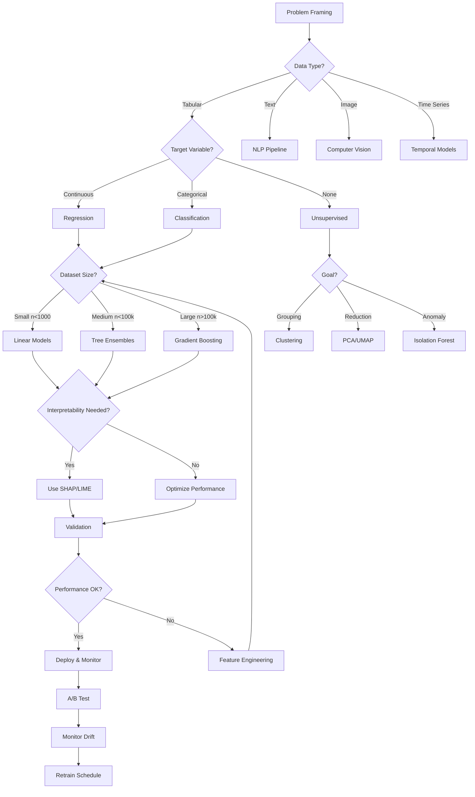
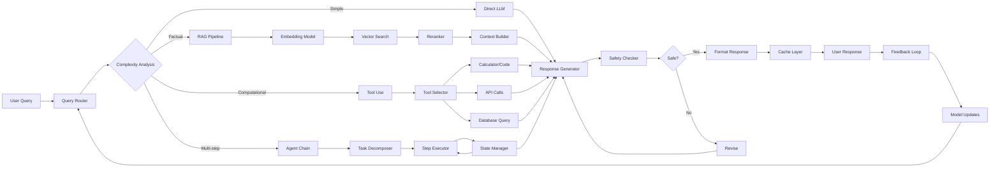

# PearlMind-ML-Journey
Built with dedication to the craft of machine learning

<div align="center">


**A curated machine learning journey from fundamentals to production-grade systems**

[Profile](https://github.com/Cazzy-Aporbo/Cazzy-Aporbo/) • [Documentation](#prebuilt-tooling--official-references) • [Models](#model-atlas-whenwhy how) • [Ethics](#bias--responsible-ai-checklist)

</div>

---

## Why This Exists

Machine learning isn't about following tutorials blindly—it's about understanding tradeoffs, making informed choices, and building systems that solve real problems. This repository documents my journey from basic linear models to production LLM orchestration, emphasizing the *why* behind every decision.

I prioritize interpretability over black-box complexity when possible, robustness over marginal accuracy gains, and ethical considerations at every stage. The code here reflects real-world constraints: compute budgets, latency requirements, and the messy reality of production data. Every model choice is justified with evidence, every optimization backed by ablation studies.

## My ML Journey (Snapshots)

```
2021 → Linear Models & Statistical Foundations
    ├── Built intuition with closed-form solutions
    └── Learned when simplicity beats complexity
    
2022 → Tree Ensembles & Feature Engineering  
    ├── Discovered the power of gradient boosting
    └── Mastered tabular data competitions
    
2023 → Time Series & Causal Inference
    ├── Deployed Prophet models for demand forecasting
    └── Learned to distinguish correlation from causation
    
2024 → Deep Learning & Computer Vision
    ├── Trained CNNs from scratch, then discovered transfer learning
    └── Built custom architectures for domain-specific tasks
    
2025 → LLMs, RAG, & Production Systems
    ├── Implemented hybrid retrieval-augmented generation
    ├── Built router systems for model selection
    └── Deployed tool-augmented LLM pipelines
```

## Model Atlas: When/Why/How

Each model has its place. The art lies in knowing which tool fits the problem—and more importantly, which doesn't.

### Linear/Logistic Regression

Linear models remain the workhorses of machine learning. They offer unparalleled interpretability and serve as crucial baselines. When your stakeholders need to understand exactly why a decision was made, nothing beats the transparency of coefficients.

**When to Use**: High-stakes decisions requiring explainability (credit scoring, medical diagnosis), baseline models, feature importance analysis, when you have strong domain knowledge about linear relationships.

**Shines At**: Small datasets (n < 1000), wide data (p >> n with regularization), real-time inference, A/B testing where effect sizes matter, problems where monotonicity constraints are critical.

**Watch-outs**: Assumes linear relationships (use polynomial features or splines for flexibility), sensitive to outliers (consider robust regression), multicollinearity inflates variance (use Ridge/Elastic Net), requires careful feature engineering.

### Support Vector Machines

SVMs elegantly handle high-dimensional spaces through the kernel trick, transforming nonlinear problems into linear ones in higher dimensions. The margin maximization principle provides excellent generalization, especially with limited data.

**When to Use**: Text classification, bioinformatics (gene expression), image recognition with hand-crafted features, when you need probability calibration (with Platt scaling), anomaly detection (One-Class SVM).

**Shines At**: High-dimensional sparse data, binary classification with clear margin, robust to overfitting in high dimensions, effective with small-to-medium datasets.

**Watch-outs**: Computationally expensive for large datasets (O(n²) to O(n³)), kernel selection is critical, requires feature scaling, probability estimates need calibration, memory intensive for RBF kernels.

### Decision Trees & Ensembles

Tree-based models capture nonlinear interactions naturally, require minimal preprocessing, and handle mixed data types gracefully. The ensemble variants consistently dominate tabular competitions.

#### Random Forest

**When to Use**: Baseline for any tabular problem, feature importance is critical, need out-of-bag error estimates, parallel training is available, want to reduce overfitting from single trees.

**Shines At**: Mixed numerical/categorical features, missing data (proximity imputation), nonlinear relationships, built-in cross-validation via OOB, embarrassingly parallel.

**Watch-outs**: Can't extrapolate beyond training range, memory intensive for large forests, prediction latency scales with tree count, biased towards high-cardinality features.

#### Gradient Boosting (XGBoost/LightGBM/CatBoost)

**When to Use**: Kaggle competitions (seriously), maximum predictive accuracy needed, have time for hyperparameter tuning, dealing with imbalanced classes, need monotonic constraints.

**XGBoost Shines At**: Structured/tabular data competitions, handling missing values, custom objectives, GPU acceleration, distributed training.

**LightGBM Shines At**: Large datasets (leaf-wise growth), categorical features (optimal splits), faster training than XGBoost, lower memory usage.

**CatBoost Shines At**: Categorical features without encoding, robust to hyperparameters, symmetric trees reduce overfitting, built-in text features, best default parameters.

**Watch-outs**: Prone to overfitting (early stopping essential), sequential nature limits parallelization, hyperparameter sensitive, longer inference than RF, requires careful learning rate scheduling.

### Unsupervised Learning

Unsupervised methods reveal hidden structure in data, crucial for exploration before supervised modeling.

#### Clustering (K-Means/GMM/DBSCAN)

**K-Means**: Fast, scalable, works well for spherical clusters. Use when cluster count is known, need quick results, implementing vector quantization.

**GMM (Gaussian Mixture Models)**: Soft clustering with probability assignments, handles elliptical clusters, provides uncertainty estimates. Use for overlapping clusters, when you need membership probabilities.

**DBSCAN**: Density-based, finds arbitrary shaped clusters, robust to outliers. Use when cluster count unknown, have varying densities, need noise detection.

#### Dimensionality Reduction (PCA/UMAP/t-SNE)

**PCA**: Linear, fast, preserves global structure. Use for denoising, feature extraction, visualization of linear relationships, preprocessing for other algorithms.

**UMAP**: Preserves both local and global structure, scalable. Use for general-purpose visualization, preprocessing for clustering, manifold learning.

**t-SNE**: Excellent for visualization, preserves local structure. Use primarily for 2D/3D visualization, identifying clusters visually. Not for preprocessing—distances aren't meaningful.

### Time Series

Time series requires specialized methods that respect temporal dependencies and handle trends, seasonality, and external regressors.

#### Classical Methods (ARIMA/SARIMA)

**When to Use**: Univariate forecasting, well-understood seasonal patterns, need prediction intervals, interpretable components, small datasets.

**Shines At**: Short-term forecasting, stable patterns, when you need to explain the model to stakeholders, automatic order selection (auto-ARIMA).

**Watch-outs**: Assumes stationarity (difference if needed), struggles with multiple seasonalities, can't handle external regressors well, poor at long-term forecasting.

#### Prophet

Facebook's Prophet handles holidays, changepoints, and multiple seasonalities automatically. It's remarkably robust to missing data and outliers.

**When to Use**: Business forecasting with domain knowledge, multiple seasonalities, need to incorporate holidays/events, want uncertainly quantification, irregular time series.

**Shines At**: Automatic changepoint detection, intuitive hyperparameters, handles missing data, built-in cross-validation, additive model components.

**Watch-outs**: Not suitable for sub-daily data without modifications, can overfit with too many changepoints, Bayesian backend can be slow, less accurate than deep learning for complex patterns.

#### Deep Learning for Time Series (Brief Mention)

**Temporal Fusion Transformers (TFT)**: State-of-the-art for multi-horizon forecasting, handles static covariates, provides interpretable attention weights.

**DeepAR**: Probabilistic forecasting, trains globally on related time series, handles cold-start problems.

### Deep Learning

Neural networks excel at learning hierarchical representations from raw data, eliminating manual feature engineering.

#### Convolutional Neural Networks (CNNs)

**When to Use**: Image classification/segmentation/detection, any data with spatial structure, transfer learning from ImageNet, video understanding (3D CNNs).

**Shines At**: Translation invariance, parameter sharing, hierarchical feature learning, transfer learning, real-time inference with optimization.

**Watch-outs**: Require large datasets (or transfer learning), computationally expensive training, black-box nature, adversarial vulnerability.

#### Vision Transformers (ViT)

**When to Use**: When you have massive datasets, need state-of-the-art accuracy, can afford longer training, want to leverage pre-trained models.

**Shines At**: Scaling to huge datasets, global context from layer 1, transfer learning across domains, self-supervised pre-training.

**Watch-outs**: Require more data than CNNs, computationally expensive, less inductive bias, need careful position encoding.

#### RNNs/Transformers

**RNNs**: Use for smaller sequential datasets, when computation is limited, online/streaming predictions. LSTMs/GRUs handle long-term dependencies better than vanilla RNNs.

**Transformers**: Current state-of-the-art for NLP, parallelize better than RNNs, attention provides interpretability, foundation for all modern LLMs.

### LLMs & Hybrid Systems

Modern AI systems combine multiple models, retrieval mechanisms, and external tools to solve complex, multi-step problems.

#### RAG (Retrieval-Augmented Generation)

RAG systems ground LLM responses in retrieved knowledge, reducing hallucinations and enabling dynamic knowledge updates without retraining.

**When to Use**: Domain-specific QA, need factual grounding, knowledge changes frequently, can't fine-tune due to compute/data constraints, need source attribution.

**Shines At**: Reducing hallucinations, handling long-tail queries, updatable knowledge base, explainable responses with citations, hybrid search (semantic + keyword).

**Watch-outs**: Retrieval quality bottlenecks performance, context window limitations, latency from retrieval step, challenging evaluation, requires careful chunking strategy.

#### Router Systems

Routers dynamically select the best model/approach for each query, optimizing for accuracy, latency, and cost simultaneously.

**When to Use**: Multiple specialized models available, varying query complexity, cost/latency constraints, need graceful degradation, A/B testing model variants.

**Shines At**: Optimal resource allocation, handling diverse query types, cost optimization, automatic failover, performance monitoring.

**Watch-outs**: Router becomes a bottleneck, adds complexity, requires calibrated confidence scores, cold-start problem for new query types.

#### Tool-Augmented LLMs (Toolformer-style)

LLMs that can invoke external tools (calculators, APIs, databases) overcome limitations in reasoning, freshness, and domain-specific knowledge.

**When to Use**: Need precise calculations, access external systems, multi-step reasoning, real-time data requirements, complex workflows.

**Shines At**: Mathematical reasoning, API orchestration, data analysis tasks, multi-modal workflows, agent-based systems.

**Watch-outs**: Tool reliability affects system performance, prompt engineering complexity, error propagation, security considerations, increased latency.

## Relational Diagrams (Mermaid)

### Model Selection Flow (Tabular Data Focus)



### RAG + Router Hybrid Pipeline



## The Prompt Ladder (Beginner → Expert)

Each rung represents increasing sophistication in how you interact with ML systems. Copy these prompts directly into your workflow.

### Rung 1: Beginner - Explain Predictions
```
Given this model prediction of [PREDICTION] for input [FEATURES], 
explain in plain English:
1. What each feature means in simple terms
2. Which features most influenced this prediction
3. Whether this prediction seems reasonable and why
4. What a different outcome would require

Format as a brief narrative a business stakeholder would understand.
```

### Rung 2: Practitioner - Diagnose Failure Modes
```
Analyze this model's failure cases:
- False Positives: [EXAMPLES]
- False Negatives: [EXAMPLES]
- Edge Cases: [EXAMPLES]

Perform root cause analysis:
1. Identify systematic patterns in failures
2. Propose feature engineering to address each pattern
3. Design targeted data collection for failure modes
4. Specify ablation studies to validate hypotheses

Provide metrics for: precision@k, recall curves, confusion matrix per segment.
Consider distribution shift, label noise, and feature leakage.
```

### Rung 3: Bias & Calibration - Deep Fairness Analysis
```
Evaluate model fairness across protected groups [GROUPS]:

Quantitative Analysis:
- Disparate impact: P(Y=1|A=a)/P(Y=1|A=b) for all group pairs
- Equal opportunity difference: TPR gaps
- Calibration: P(Y=1|score=s, A=a) vs P(Y=1|score=s, A=b)
- Expected Calibration Error (ECE) and Brier score per group

Reliability Narrative:
- Are high-confidence predictions equally reliable across groups?
- Where does the model exhibit systematic over/under-confidence?
- What recourse exists for disadvantaged predictions?

Recommend: pre-processing, in-processing, or post-processing interventions.
Include: sample size considerations, statistical significance, and multiple testing corrections.
```

### Rung 4: Hybrid Decisions - Router Policy Design
```
Design routing policy for model ensemble:

Models Available:
- Fast Model: latency=[X]ms, accuracy=[Y]%, cost=$[Z]
- Accurate Model: latency=[A]ms, accuracy=[B]%, cost=$[C]  
- Specialist Models: [DOMAIN_MODELS]

Constraints:
- P50 latency < [L1]ms, P99 latency < [L2]ms
- Cost budget: $[BUDGET]/1M requests
- Minimum accuracy: [MIN_ACC]%

Optimize routing function:
1. Confidence-based routing with calibrated thresholds
2. Query complexity scoring (length, vocabulary, structure)
3. Dynamic batching for throughput optimization
4. Cascade architecture with early-exit criteria

Output: Decision tree with thresholds, expected system metrics,
failover logic, and monitoring dashboard specification.
```

### Rung 5: Expert - Production Stewardship
```
Design production ML system architecture:

System Requirements:
- Scale: [QPS] queries/second, [STORAGE] TB data
- SLA: [UPTIME]% availability, [LATENCY] P99
- Compliance: [REGULATIONS] (GDPR, CCPA, etc.)

Provide:
1. Training pipeline: data versioning (DVC/Pachyderm), feature store design,
   experiment tracking (MLflow/W&B), distributed training orchestration

2. Serving architecture: model registry, A/B test infrastructure,
   feature computation (batch vs. real-time), cache strategy by query pattern

3. Monitoring specification:
   - Data drift: PSI, KS-statistic, MMD thresholds
   - Concept drift: prediction distribution, accuracy proxies
   - System metrics: latency percentiles, throughput, error rates
   
4. Rollback triggers: automatic (metric thresholds) vs manual (incident types)

5. Audit trail: model lineage, decision logs, compliance reports,
   explainability API for regulators

Include: cost optimization strategy, multi-region deployment,
shadow mode testing, gradual rollout plan.
```

## Bias & Responsible AI Checklist

A production ML system is only as ethical as its most overlooked edge case. This checklist ensures systematic consideration of fairness, accountability, and transparency.

**Problem Definition**
- [ ] Stakeholders identified and consulted (especially affected communities)
- [ ] Success metrics include fairness indicators, not just accuracy
- [ ] Potential negative impacts documented with mitigation strategies
- [ ] Alternative non-ML solutions evaluated

**Data Provenance & Quality**
- [ ] Data collection process documented with potential biases noted
- [ ] Representation gaps identified (geographic, demographic, temporal)
- [ ] Label quality assessed, including annotator demographics and agreement rates
- [ ] Privacy-preserving techniques applied (differential privacy, PII removal)

**Training & Evaluation**
- [ ] Stratified splits ensure all groups represented in train/val/test
- [ ] Evaluation metrics computed per demographic group
- [ ] Intersectional analysis performed (not just single attributes)
- [ ] Temporal validation simulates production deployment

**Subgroup Performance Metrics**
- [ ] Confusion matrices per protected attribute
- [ ] Worst-group performance highlighted, not just average
- [ ] Statistical significance tested with appropriate corrections
- [ ] Confidence intervals provided for small subgroups

**Calibration & Reliability**
- [ ] Calibration plots per subgroup
- [ ] Brier score decomposition (calibration + refinement)
- [ ] Over/under-confidence patterns documented
- [ ] Score distributions compared across groups

**Interventions & Mitigations**
- [ ] Pre-processing: reweighting, synthetic minority oversampling
- [ ] In-processing: fairness constraints, adversarial debiasing
- [ ] Post-processing: threshold optimization, calibration adjustment
- [ ] Trade-offs between fairness metrics explicitly stated

**Human-in-the-Loop (HITL)**
- [ ] Clear escalation paths for edge cases
- [ ] Human review for high-stakes decisions
- [ ] Interface design prevents automation bias
- [ ] Feedback loops from human decisions to model updates

**Monitoring & Maintenance**
- [ ] Fairness metrics in production dashboards
- [ ] Alerts for degradation in any subgroup
- [ ] Regular audits scheduled (monthly/quarterly)
- [ ] User feedback channels with response SLAs

**Audit Trail & Documentation**
- [ ] Model cards completed with limitations section
- [ ] Decision logs retained per regulatory requirements
- [ ] Explainability API available for contested decisions
- [ ] Version control for models, data, and configurations

## Prebuilt Tooling & Official References

Production ML requires a carefully chosen stack. These are the battle-tested libraries that form the foundation of modern ML systems.

### Core ML Libraries
- **Scikit-learn** — https://scikit-learn.org — The Swiss Army knife of ML. Consistent API, extensive algorithms, excellent documentation.
- **XGBoost** — https://xgboost.ai — Gradient boosting that wins competitions. Supports custom objectives, monotonic constraints.
- **LightGBM** — https://lightgbm.readthedocs.io — Microsoft's faster gradient boosting. Leaf-wise tree growth, categorical feature support.
- **CatBoost** — https://catboost.ai — Yandex's gradient boosting with best defaults. Handles categoricals natively, symmetric trees reduce overfitting.

### Statistical & Time Series
- **Statsmodels** — https://www.statsmodels.org — Statistical modeling with R-like formulas. Comprehensive test suite, detailed result objects.
- **Prophet** — https://facebook.github.io/prophet/ — Facebook's forecasting tool. Handles seasonality, holidays, changepoints automatically.

### Deep Learning Frameworks
- **PyTorch** — https://pytorch.org — Research-friendly with dynamic graphs. Excellent debugging, growing ecosystem.
- **TensorFlow/Keras** — https://www.tensorflow.org — Production-ready with extensive deployment options. TFX for pipelines, TF Serving for inference.

### NLP & Transformers
- **Hugging Face Transformers** — https://huggingface.co/docs/transformers — Every SOTA language model. Incredible model hub, training utilities, evaluation metrics.

### Vector Search & RAG
- **FAISS** — https://github.com/facebookresearch/faiss — Facebook's similarity search. Billion-scale vector search, GPU acceleration, multiple index types.
- **LangChain** — https://python.langchain.com — LLM application framework. Chains, agents, tools, memory, extensive integrations.
- **Haystack** — https://docs.haystack.deepset.ai — End-to-end NLP framework. Document stores, retrievers, readers, complete pipelines.

### Model Optimization & Deployment
- **ONNX** — https://onnx.ai — Open neural network exchange. Cross-framework model portability, optimization for inference.
- **OpenVINO** — https://docs.openvino.ai — Intel's inference toolkit. CPU optimization, INT8 quantization, edge deployment.

## Project Structure

A production ML repository requires thoughtful organization. This structure has served me well across research and deployment.

```
PearlMind-ML-Journey/
├── assets/
│   ├── header_loop.gif         # Pastel gradient animation
│   ├── confetti.json           # Success celebration Lottie
│   └── diagrams/               # Architecture diagrams
├── data/
│   ├── raw/                    # Immutable original data
│   ├── processed/              # Feature engineering outputs
│   ├── features/               # Feature store exports
│   └── cache/                  # Computed intermediates
├── models/
│   ├── baseline/               # Simple models for comparison
│   ├── experiments/            # Hyperparameter search results
│   ├── production/             # Deployed model artifacts
│   └── registry/               # Model versioning metadata
├── notebooks/
│   ├── exploration/            # EDA and hypotheses
│   ├── modeling/               # Training experiments
│   ├── evaluation/             # Performance analysis
│   └── reports/                # Stakeholder-ready analyses
├── src/
│   ├── data/
│   │   ├── loaders.py         # Data ingestion
│   │   ├── processors.py      # Cleaning, normalization
│   │   ├── validators.py      # Schema enforcement
│   │   └── splitters.py       # Train/val/test splitting
│   ├── features/
│   │   ├── extractors.py      # Feature engineering
│   │   ├── transformers.py    # Scikit-learn compatible
│   │   └── store.py           # Feature versioning
│   ├── models/
│   │   ├── baseline.py        # Linear, tree models
│   │   ├── ensemble.py        # Boosting, voting
│   │   ├── neural.py          # Deep learning
│   │   └── hybrid.py          # RAG, routers
│   ├── evaluation/
│   │   ├── metrics.py         # Custom metrics
│   │   ├── fairness.py       # Bias detection
│   │   ├── calibration.py    # Reliability analysis
│   │   └── monitoring.py     # Drift detection
│   ├── deployment/
│   │   ├── serving.py         # Model serving logic
│   │   ├── preprocessing.py  # Request transformation
│   │   ├── postprocessing.py # Response formatting
│   │   └── monitoring.py     # Production metrics
│   └── utils/
│       ├── config.py          # Configuration management
│       ├── logging.py         # Structured logging
│       ├── profiling.py       # Performance analysis
│       └── visualization.py   # Plotting utilities
├── tests/
│   ├── unit/                  # Function-level tests
│   ├── integration/           # Pipeline tests
│   ├── inference/             # Model behavior tests
│   └── fixtures/              # Test data
├── configs/
│   ├── model_configs/         # Hyperparameters
│   ├── feature_configs/       # Feature definitions
│   ├── deployment_configs/    # Serving settings
│   └── monitoring_configs/    # Alert thresholds
├── scripts/
│   ├── train.py              # Training orchestration
│   ├── evaluate.py           # Offline evaluation
│   ├── deploy.py             # Deployment automation
│   └── monitor.py            # Production monitoring
├── docs/
│   ├── model_cards/          # Model documentation
│   ├── api/                  # API reference
│   ├── guides/               # How-to guides
│   └── decisions/            # Architecture decisions
├── .github/
│   └── workflows/
│       ├── ci.yml            # Continuous integration
│       ├── cd.yml            # Continuous deployment
│       └── monitoring.yml    # Scheduled checks
├── requirements/
│   ├── base.txt              # Core dependencies
│   ├── dev.txt               # Development tools
│   ├── test.txt              # Testing libraries
│   └── prod.txt              # Production only
├── Dockerfile                 # Container definition
├── Makefile                   # Common commands
├── pyproject.toml            # Project metadata
└── README.md                 # You are here
```

## About

I'm Cazandra Aporbo, a mdata scientist who loves ML algorithms and I am focused on building systems that work in the real world. My approach emphasizes robustness over complexity, interpretability over black boxes, and ethical considerations at every stage of development.

This repository represents years of learning, failing, debugging, and eventually succeeding. Every line of code has been written with production constraints in mind—because models that only work in notebooks don't solve real problems.

Connect with me on [GitHub](https://github.com/Cazzy-Aporbo/Cazzy-Aporbo/) to discuss ML, share ideas, or collaborate on projects that push the boundaries of what's possible while keeping our feet firmly planted in what's practical.

---

<div align="center">

**PearlMind ML Journey** • Built with dedication to the craft of machine learning

*"The best model is not the most complex one, but the one that solves the problem."*

</div>
