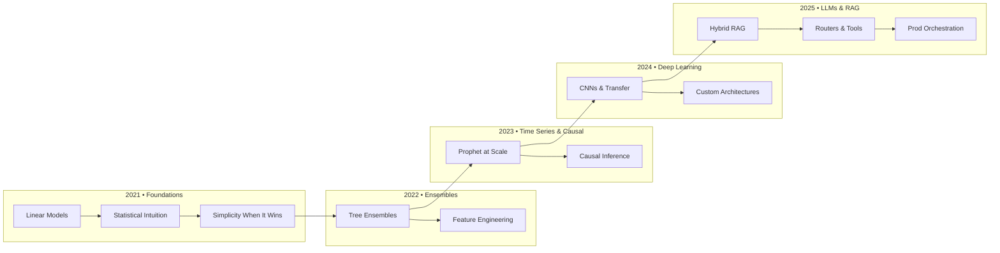
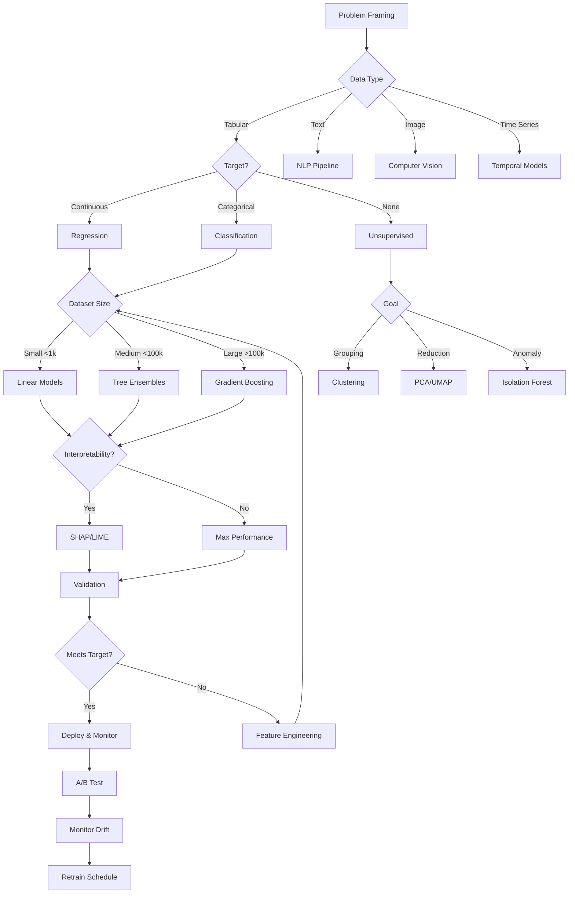
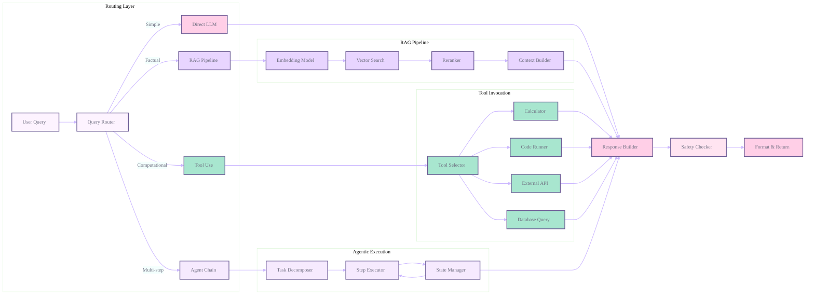

# PearlMind-ML-Journey

<div align="center">

<!-- Sophisticated animated header with gradient waves -->


<!-- Professional ML/AI badges with pastel theme -->
[](https://www.python.org/)
[](https://pytorch.org/)
[](https://www.tensorflow.org/)
[](https://scikit-learn.org/)
[](https://xgboost.ai/)
[](https://huggingface.co/)

<!-- Status badges -->
[](https://github.com/Cazzy-Aporbo/PearlMind-ML-Journey)
[](https://github.com/Cazzy-Aporbo/PearlMind-ML-Journey)
[](https://github.com/Cazzy-Aporbo/PearlMind-ML-Journey)
[](https://github.com/Cazzy-Aporbo/PearlMind-ML-Journey)
[](LICENSE)

<!-- Animated typing with ML insights -->


<!-- GitHub Stats Cards with custom theme -->


<!-- Sophisticated divider -->


<!-- Activity Graph -->


<kbd><a href="#model-atlas-mathematical-foundations--production-insights">📊 Models</a></kbd> • 
<kbd><a href="#the-prompt-ladder-beginner--expert">🪜 Prompts</a></kbd> • 
<kbd><a href="#bias--responsible-ai-checklist">⚖️ Ethics</a></kbd> • 
<kbd><a href="#mathematical-intuitions--humor">🧮 Math</a></kbd> • 
<kbd><a href="https://github.com/Cazzy-Aporbo">👤 Profile</a></kbd>

</div>

<!-- Elegant separator -->
<div align="center">

</div>
  <defs>
    <linearGradient id="header-gradient" x1="0%" y1="0%" x2="100%" y2="0%">
      <stop offset="0%" style="stop-color:#FFCFE7">
        <animate attributeName="stop-color" values="#FFCFE7;#F6EAFE;#A8E6CF;#FFE4F1;#E8D5FF;#FFCFE7" dur="8s" repeatCount="indefinite" />
      </stop>
      <stop offset="50%" style="stop-color:#F6EAFE">
        <animate attributeName="stop-color" values="#F6EAFE;#A8E6CF;#FFE4F1;#E8D5FF;#FFCFE7;#F6EAFE" dur="8s" repeatCount="indefinite" />
      </stop>
      <stop offset="100%" style="stop-color:#A8E6CF">
        <animate attributeName="stop-color" values="#A8E6CF;#FFE4F1;#E8D5FF;#FFCFE7;#F6EAFE;#A8E6CF" dur="8s" repeatCount="indefinite" />
      </stop>
    </linearGradient>
    <radialGradient id="pulse-gradient">
      <stop offset="0%" style="stop-color:white;stop-opacity:0.3">
        <animate attributeName="stop-opacity" values="0.3;0.6;0.3" dur="4s" repeatCount="indefinite" />
      </stop>
      <stop offset="100%" style="stop-color:white;stop-opacity:0" />
    </radialGradient>
    <filter id="glow">
      <feGaussianBlur stdDeviation="3" result="coloredBlur"/>
      <feMerge>
        <feMergeNode in="coloredBlur"/>
        <feMergeNode in="SourceGraphic"/>
      </feMerge>
    </filter>
  </defs>
  
  <!-- Background with gradient -->
  <rect width="100%" height="200" fill="url(#header-gradient)" rx="15" />
  
  <!-- Pulse effect -->
  <circle cx="50%" cy="50%" r="150" fill="url(#pulse-gradient)">
    <animate attributeName="r" values="100;150;100" dur="4s" repeatCount="indefinite" />
  </circle>
  
  <!-- Title -->
  <text x="50%" y="45%" text-anchor="middle" font-family="system-ui, -apple-system, sans-serif" font-size="36" font-weight="bold" fill="white" filter="url(#glow)">
    <animate attributeName="opacity" values="0.7;1;0.7" dur="3s" repeatCount="indefinite"/>
    PearlMind ML Journey
  </text>
  
  <!-- Subtitle -->
  <text x="50%" y="60%" text-anchor="middle" font-family="system-ui, -apple-system, sans-serif" font-size="16" fill="white" opacity="0.9">
    From Mathematical Foundations to Ethical Superintelligence
  </text>
  
  <!-- Floating particles -->
  <circle r="2" fill="white" opacity="0.6">
    <animate attributeName="cy" values="180;20;180" dur="10s" repeatCount="indefinite" />
    <animate attributeName="cx" values="10%;90%;10%" dur="15s" repeatCount="indefinite" />
  </circle>
  <circle r="3" fill="white" opacity="0.4">
    <animate attributeName="cy" values="190;10;190" dur="12s" repeatCount="indefinite" />
    <animate attributeName="cx" values="90%;10%;90%" dur="18s" repeatCount="indefinite" />
  </circle>
  <circle r="2" fill="white" opacity="0.5">
    <animate attributeName="cy" values="170;30;170" dur="8s" repeatCount="indefinite" />
    <animate attributeName="cx" values="30%;70%;30%" dur="14s" repeatCount="indefinite" />
  </circle>
</svg>

<br/><br/>

<!-- Core stack badges -->


<br/><br/>

<!-- Animated Status Indicators -->
<svg width="450" height="40" xmlns="http://www.w3.org/2000/svg">
  <defs>
    <filter id="shadow-filter">
      <feDropShadow dx="0" dy="2" stdDeviation="2" flood-opacity="0.2"/>
    </filter>
  </defs>
  
  <!-- Build Status -->
  <rect x="10" y="10" width="120" height="25" fill="#FFCFE7" rx="12" filter="url(#shadow-filter)">
    <animate attributeName="width" values="120;130;120" dur="2s" repeatCount="indefinite"/>
  </rect>
  <text x="70" y="27" text-anchor="middle" font-family="system-ui" font-size="12" fill="#6B5B95" font-weight="600">✨ Active</text>
  
  <!-- Activity Status -->
  <rect x="160" y="10" width="120" height="25" fill="#F6EAFE" rx="12" filter="url(#shadow-filter)">
    <animate attributeName="width" values="120;130;120" dur="2s" begin="0.5s" repeatCount="indefinite"/>
  </rect>
  <text x="220" y="27" text-anchor="middle" font-family="system-ui" font-size="12" fill="#6B5B95" font-weight="600">🚀 Building</text>
  
  <!-- Stars Status -->
  <rect x="310" y="10" width="120" height="25" fill="#A8E6CF" rx="12" filter="url(#shadow-filter)">
    <animate attributeName="width" values="120;130;120" dur="2s" begin="1s" repeatCount="indefinite"/>
  </rect>
  <text x="370" y="27" text-anchor="middle" font-family="system-ui" font-size="12" fill="#6B5B95" font-weight="600">📚 Learning</text>
</svg>

<br/><br/>

<kbd><a href="https://github.com/Cazzy-Aporbo/Cazzy-Aporbo/">Profile</a></kbd> • <kbd><a href="#model-atlas-mathematical-foundations--production-insights">Models</a></kbd> • <kbd><a href="#the-prompt-ladder-beginner--expert">Prompts</a></kbd> • <kbd><a href="#bias--responsible-ai-checklist">Ethics</a></kbd> • <kbd><a href="#mathematical-intuitions--humor">Math</a></kbd>

</div>

<br/>

<!-- Animated Sparkle Divider -->
<div align="center">
<svg width="100%" height="30" xmlns="http://www.w3.org/2000/svg">
  <defs>
    <linearGradient id="divider-gradient" x1="0%" y1="0%" x2="100%" y2="0%">
      <stop offset="0%" style="stop-color:#E8D5FF;stop-opacity:0" />
      <stop offset="50%" style="stop-color:#E8D5FF;stop-opacity:1" />
      <stop offset="100%" style="stop-color:#E8D5FF;stop-opacity:0" />
    </linearGradient>
  </defs>
  <rect x="0" y="14" width="100%" height="2" fill="url(#divider-gradient)" />
  
  <!-- Multiple sparkles -->
  <g>
    <circle r="3" fill="#FFCFE7">
      <animateMotion path="M 0,15 L 1200,15" dur="3s" repeatCount="indefinite" />
      <animate attributeName="opacity" values="0;1;1;0" dur="3s" repeatCount="indefinite" />
    </circle>
    <circle r="2" fill="white">
      <animateMotion path="M 0,15 L 1200,15" dur="3s" repeatCount="indefinite" />
      <animate attributeName="opacity" values="0;0.8;0.8;0" dur="3s" repeatCount="indefinite" />
    </circle>
  </g>
  
  <g>
    <circle r="3" fill="#F6EAFE">
      <animateMotion path="M 0,15 L 1200,15" dur="3s" begin="1s" repeatCount="indefinite" />
      <animate attributeName="opacity" values="0;1;1;0" dur="3s" begin="1s" repeatCount="indefinite" />
    </circle>
    <circle r="2" fill="white">
      <animateMotion path="M 0,15 L 1200,15" dur="3s" begin="1s" repeatCount="indefinite" />
      <animate attributeName="opacity" values="0;0.8;0.8;0" dur="3s" begin="1s" repeatCount="indefinite" />
    </circle>
  </g>
  
  <g>
    <circle r="3" fill="#A8E6CF">
      <animateMotion path="M 0,15 L 1200,15" dur="3s" begin="2s" repeatCount="indefinite" />
      <animate attributeName="opacity" values="0;1;1;0" dur="3s" begin="2s" repeatCount="indefinite" />
    </circle>
    <circle r="2" fill="white">
      <animateMotion path="M 0,15 L 1200,15" dur="3s" begin="2s" repeatCount="indefinite" />
      <animate attributeName="opacity" values="0;0.8;0.8;0" dur="3s" begin="2s" repeatCount="indefinite" />
    </circle>
  </g>
</svg>
</div>

## Why This Exists: The Quest for Ethical Superintelligence

As a data scientist deeply fascinated by the emergence of superintelligence, I believe the path forward requires not just technical excellence but profound ethical grounding. This repository chronicles my journey from statistical foundations to advanced AI systems, guided by the principle that powerful intelligence must be aligned with human values.

The transition from narrow AI to general intelligence will not come from brute force alone. It rests on sound mathematics, careful system design, and the discipline to ship interpretable, controllable, and beneficial models. Every project here reflects ablation studies, fairness audits, and production constraints.

<div align="center">
<!-- Philosophy Animation with floating and pulsing -->
<svg width="100%" height="200" xmlns="http://www.w3.org/2000/svg" viewBox="0 0 800 200">
  <defs>
    <filter id="node-shadow">
      <feDropShadow dx="0" dy="4" stdDeviation="4" flood-opacity="0.2"/>
    </filter>
    <linearGradient id="node1-gradient" x1="0%" y1="0%" x2="100%" y2="100%">
      <stop offset="0%" style="stop-color:#FFCFE7" />
      <stop offset="100%" style="stop-color:#F6EAFE" />
    </linearGradient>
    <linearGradient id="node2-gradient" x1="0%" y1="0%" x2="100%" y2="100%">
      <stop offset="0%" style="stop-color:#F6EAFE" />
      <stop offset="100%" style="stop-color:#A8E6CF" />
    </linearGradient>
    <linearGradient id="node3-gradient" x1="0%" y1="0%" x2="100%" y2="100%">
      <stop offset="0%" style="stop-color:#A8E6CF" />
      <stop offset="100%" style="stop-color:#FFE4F1" />
    </linearGradient>
  </defs>
  
  <!-- Node 1: Math Foundations -->
  <g transform="translate(150, 100)">
    <ellipse rx="90" ry="35" fill="url(#node1-gradient)" filter="url(#node-shadow)">
      <animate attributeName="ry" values="35;40;35" dur="4s" repeatCount="indefinite"/>
      <animate attributeName="rx" values="90;95;90" dur="4s" repeatCount="indefinite"/>
    </ellipse>
    <text text-anchor="middle" y="5" font-family="system-ui" font-size="14" fill="#6B5B95" font-weight="600">
      <animate attributeName="y" values="5;0;5" dur="4s" repeatCount="indefinite"/>
      Math Foundations
    </text>
  </g>
  
  <!-- Arrow 1 with pulse -->
  <g>
    <line x1="240" y1="100" x2="310" y2="100" stroke="#E8D5FF" stroke-width="2">
      <animate attributeName="stroke-width" values="2;4;2" dur="2s" repeatCount="indefinite"/>
    </line>
    <polygon points="310,95 320,100 310,105" fill="#E8D5FF">
      <animate attributeName="opacity" values="0.3;1;0.3" dur="2s" repeatCount="indefinite"/>
      <animateTransform attributeName="transform" type="translate" values="0,0; 5,0; 0,0" dur="2s" repeatCount="indefinite"/>
    </polygon>
  </g>
  
  <!-- Node 2: Ethical AI -->
  <g transform="translate(400, 100)">
    <ellipse rx="90" ry="35" fill="url(#node2-gradient)" filter="url(#node-shadow)">
      <animate attributeName="ry" values="35;40;35" dur="4s" begin="1s" repeatCount="indefinite"/>
      <animate attributeName="rx" values="90;95;90" dur="4s" begin="1s" repeatCount="indefinite"/>
    </ellipse>
    <text text-anchor="middle" y="5" font-family="system-ui" font-size="14" fill="#6B5B95" font-weight="600">
      <animate attributeName="y" values="5;0;5" dur="4s" begin="1s" repeatCount="indefinite"/>
      Ethical AI
    </text>
  </g>
  
  <!-- Arrow 2 with pulse -->
  <g>
    <line x1="490" y1="100" x2="560" y2="100" stroke="#E8D5FF" stroke-width="2">
      <animate attributeName="stroke-width" values="2;4;2" dur="2s" begin="1s" repeatCount="indefinite"/>
    </line>
    <polygon points="560,95 570,100 560,105" fill="#E8D5FF">
      <animate attributeName="opacity" values="0.3;1;0.3" dur="2s" begin="1s" repeatCount="indefinite"/>
      <animateTransform attributeName="transform" type="translate" values="0,0; 5,0; 0,0" dur="2s" begin="1s" repeatCount="indefinite"/>
    </polygon>
  </g>
  
  <!-- Node 3: Superintelligence -->
  <g transform="translate(650, 100)">
    <ellipse rx="90" ry="35" fill="url(#node3-gradient)" filter="url(#node-shadow)">
      <animate attributeName="ry" values="35;40;35" dur="4s" begin="2s" repeatCount="indefinite"/>
      <animate attributeName="rx" values="90;95;90" dur="4s" begin="2s" repeatCount="indefinite"/>
    </ellipse>
    <text text-anchor="middle" y="5" font-family="system-ui" font-size="14" fill="#6B5B95" font-weight="600">
      <animate attributeName="y" values="5;0;5" dur="4s" begin="2s" repeatCount="indefinite"/>
      Superintelligence
    </text>
  </g>
</svg>
</div>

---

## Mathematical Intuitions & Humor

Throughout this journey, humor helps crystallize concepts.

<div align="center">
<svg width="100%" height="250" xmlns="http://www.w3.org/2000/svg">
  <defs>
    <linearGradient id="code-bg" x1="0%" y1="0%" x2="100%" y2="100%">
      <stop offset="0%" style="stop-color:#FDF3FF;stop-opacity:0.3" />
      <stop offset="100%" style="stop-color:#F6EAFE;stop-opacity:0.3" />
    </linearGradient>
  </defs>
  
  <!-- Background -->
  <rect width="100%" height="250" fill="url(#code-bg)" rx="10" />
  
  <!-- Equation 1 -->
  <text x="50%" y="40" text-anchor="middle" font-family="monospace" font-size="16" fill="#6B5B95" font-weight="600">
    Training Accuracy → 1, Test Accuracy → 0
  </text>
  <text x="50%" y="65" text-anchor="middle" font-family="monospace" font-size="14" fill="#6E6E80">
    <animate attributeName="opacity" values="0;1;1;0" dur="4s" repeatCount="indefinite"/>
    (Life's purest overfit.)
  </text>
  
  <!-- Equation 2 -->
  <text x="50%" y="110" text-anchor="middle" font-family="monospace" font-size="16" fill="#6B5B95" font-weight="600">
    Happiness = 1/Bias + 1/Variance
  </text>
  <text x="50%" y="135" text-anchor="middle" font-family="monospace" font-size="14" fill="#6E6E80">
    <animate attributeName="opacity" values="0;1;1;0" dur="4s" begin="1.3s" repeatCount="indefinite"/>
    (You cannot minimize both.)
  </text>
  
  <!-- Equation 3 -->
  <text x="50%" y="180" text-anchor="middle" font-family="monospace" font-size="16" fill="#6B5B95" font-weight="600">
    Love(t+1) = Love(t) - η·∇Arguments
  </text>
  <text x="50%" y="205" text-anchor="middle" font-family="monospace" font-size="14" fill="#6E6E80">
    <animate attributeName="opacity" values="0;1;1;0" dur="4s" begin="2.6s" repeatCount="indefinite"/>
    (Gradient steps toward fewer conflicts.)
  </text>
</svg>
</div>

These encode truths about overfitting, the bias–variance tradeoff, and optimization landscapes.

---

## Model Atlas: Mathematical Foundations & Production Insights

<div align="center">
<!-- Animated Model Cards with 3D effect -->
<svg width="100%" height="250" xmlns="http://www.w3.org/2000/svg" viewBox="0 0 800 250">
  <defs>
    <linearGradient id="card1-grad" x1="0%" y1="0%" x2="100%" y2="100%">
      <stop offset="0%" style="stop-color:#FFCFE7" />
      <stop offset="100%" style="stop-color:#F6EAFE" />
    </linearGradient>
    <linearGradient id="card2-grad" x1="0%" y1="0%" x2="100%" y2="100%">
      <stop offset="0%" style="stop-color:#F6EAFE" />
      <stop offset="100%" style="stop-color:#A8E6CF" />
    </linearGradient>
    <linearGradient id="card3-grad" x1="0%" y1="0%" x2="100%" y2="100%">
      <stop offset="0%" style="stop-color:#A8E6CF" />
      <stop offset="100%" style="stop-color:#FFE4F1" />
    </linearGradient>
    <linearGradient id="card4-grad" x1="0%" y1="0%" x2="100%" y2="100%">
      <stop offset="0%" style="stop-color:#FFE4F1" />
      <stop offset="100%" style="stop-color:#E8D5FF" />
    </linearGradient>
    <filter id="card-shadow">
      <feDropShadow dx="0" dy="4" stdDeviation="5" flood-opacity="0.2"/>
    </filter>
  </defs>
  
  <!-- Card 1: Linear Models -->
  <g transform="translate(50, 80)">
    <rect width="150" height="100" fill="url(#card1-grad)" rx="10" filter="url(#card-shadow)">
      <animateTransform attributeName="transform" type="translate" values="0,0; 0,-10; 0,0" dur="4s" repeatCount="indefinite"/>
    </rect>
    <text x="75" y="50" text-anchor="middle" font-family="system-ui" font-size="14" fill="#6B5B95" font-weight="600">
      <animateTransform attributeName="transform" type="translate" values="0,0; 0,-10; 0,0" dur="4s" repeatCount="indefinite"/>
      Linear Models
    </text>
    <text x="75" y="70" text-anchor="middle" font-family="system-ui" font-size="11" fill="#6E6E80">
      <animateTransform attributeName="transform" type="translate" values="0,0; 0,-10; 0,0" dur="4s" repeatCount="indefinite"/>
      Foundation
    </text>
  </g>
  
  <!-- Card 2: Tree Ensembles -->
  <g transform="translate(230, 80)">
    <rect width="150" height="100" fill="url(#card2-grad)" rx="10" filter="url(#card-shadow)">
      <animateTransform attributeName="transform" type="translate" values="0,0; 0,-10; 0,0" dur="4s" begin="0.5s" repeatCount="indefinite"/>
    </rect>
    <text x="75" y="50" text-anchor="middle" font-family="system-ui" font-size="14" fill="#6B5B95" font-weight="600">
      <animateTransform attributeName="transform" type="translate" values="0,0; 0,-10; 0,0" dur="4s" begin="0.5s" repeatCount="indefinite"/>
      Tree Ensembles
    </text>
    <text x="75" y="70" text-anchor="middle" font-family="system-ui" font-size="11" fill="#6E6E80">
      <animateTransform attributeName="transform" type="translate" values="0,0; 0,-10; 0,0" dur="4s" begin="0.5s" repeatCount="indefinite"/>
      Power
    </text>
  </g>
  
  <!-- Card 3: Deep Learning -->
  <g transform="translate(410, 80)">
    <rect width="150" height="100" fill="url(#card3-grad)" rx="10" filter="url(#card-shadow)">
      <animateTransform attributeName="transform" type="translate" values="0,0; 0,-10; 0,0" dur="4s" begin="1s" repeatCount="indefinite"/>
    </rect>
    <text x="75" y="50" text-anchor="middle" font-family="system-ui" font-size="14" fill="#6B5B95" font-weight="600">
      <animateTransform attributeName="transform" type="translate" values="0,0; 0,-10; 0,0" dur="4s" begin="1s" repeatCount="indefinite"/>
      Deep Learning
    </text>
    <text x="75" y="70" text-anchor="middle" font-family="system-ui" font-size="11" fill="#6E6E80">
      <animateTransform attributeName="transform" type="translate" values="0,0; 0,-10; 0,0" dur="4s" begin="1s" repeatCount="indefinite"/>
      Scale
    </text>
  </g>
  
  <!-- Card 4: LLMs & RAG -->
  <g transform="translate(590, 80)">
    <rect width="150" height="100" fill="url(#card4-grad)" rx="10" filter="url(#card-shadow)">
      <animateTransform attributeName="transform" type="translate" values="0,0; 0,-10; 0,0" dur="4s" begin="1.5s" repeatCount="indefinite"/>
    </rect>
    <text x="75" y="50" text-anchor="middle" font-family="system-ui" font-size="14" fill="#6B5B95" font-weight="600">
      <animateTransform attributeName="transform" type="translate" values="0,0; 0,-10; 0,0" dur="4s" begin="1.5s" repeatCount="indefinite"/>
      LLMs & RAG
    </text>
    <text x="75" y="70" text-anchor="middle" font-family="system-ui" font-size="11" fill="#6E6E80">
      <animateTransform attributeName="transform" type="translate" values="0,0; 0,-10; 0,0" dur="4s" begin="1.5s" repeatCount="indefinite"/>
      Intelligence
    </text>
  </g>
</svg>
</div>

Understanding models means grasping both their theoretical core and production behavior. Below are practical notes you can rely on when choosing, explaining, and shipping.

### Linear Models: The Foundation of Interpretable AI

Linear regression aims to solve β\* = (XᵀX)⁻¹Xᵀy. Multicollinearity breaks invertibility; ridge fixes it via β\* = (XᵀX + λI)⁻¹Xᵀy. Logistic regression models log-odds with cross-entropy loss, solved by iterative optimization.

Production strengths

1. Microsecond-class inference; 2) Memory efficiency; 3) Direct interpretability; 4) Easy online learning via SGD; 5) Good calibration.

Advanced moves
Elastic Net for sparsity + grouping; basis expansions (polynomials, splines, Fourier) to keep linear-in-parameters while capturing nonlinearity.

### Support Vector Machines: Geometry Meets Optimization

Primal: minimize ½‖w‖² with yᵢ(w·xᵢ + b) ≥ 1. Dual with KKT yields sparsity in support vectors. Kernels (polynomial, RBF) make nonlinear decision boundaries tractable without explicit feature maps. Soft margins balance margin width vs training error via C. SMO and approximations (Nyström, random Fourier features) unlock scale.

### Tree Ensembles: Where Weak Learners Become Strong

Decision trees split by impurity (Gini/entropy). Ensembles fix bias–variance.

Random Forests: bagging + feature subsampling reduce variance; OOB gives free CV; beware high-cardinality bias in impurity importances.

Gradient Boosting (XGBoost/LightGBM/CatBoost): stagewise additive modeling, second-order optimization (XGB), GOSS and EFB (LGBM), ordered target encoding to prevent leakage (CatBoost). Early stopping is essential.

### Deep Learning: Universal Function Approximation

Networks as compositions of affine transforms and nonlinearities; backprop applies the chain rule efficiently. Vanishing/exploding gradients motivate ReLU, residuals, normalization. BatchNorm stabilizes training. Attention focuses computation; the lottery-ticket hypothesis hints at sparse winning subnets. Generalization benefits from implicit regularization, overparameterization regimes, and hierarchical representations.

### Large Language Models: The Emergence of Intelligence

Transformers replace recurrence with attention; positional encodings inject order. Scaling laws predict loss improvements; emergent abilities appear at scale. In-context learning suggests algorithmic behavior internal to attention. RLHF and constitutional methods align behavior; mechanistic interpretability studies circuits like induction heads. Deployment needs quantization, distillation, and retrieval grounding to reduce hallucinations.

---

## Relational Diagrams

### Learning Journey



### Model Selection Flow 



### RAG + Router Hybrid Pipeline



---

## The Prompt Ladder (Beginner → Expert)

<div align="center">
<!-- Animated Climbing Ladder -->
<svg width="100%" height="300" xmlns="http://www.w3.org/2000/svg" viewBox="0 0 800 300">
  <defs>
    <linearGradient id="ladder-gradient" x1="0%" y1="0%" x2="0%" y2="100%">
      <stop offset="0%" style="stop-color:#FDF3FF;stop-opacity:0.5" />
      <stop offset="100%" style="stop-color:#F6EAFE;stop-opacity:0.1" />
    </linearGradient>
    <filter id="ladder-shadow">
      <feDropShadow dx="0" dy="3" stdDeviation="3" flood-opacity="0.15"/>
    </filter>
  </defs>
  
  <!-- Background -->
  <rect width="100%" height="300" fill="url(#ladder-gradient)" />
  
  <!-- Ladder rails -->
  <line x1="350" y1="10" x2="350" y2="290" stroke="#E8D5FF" stroke-width="2" opacity="0.5"/>
  <line x1="450" y1="10" x2="450" y2="290" stroke="#E8D5FF" stroke-width="2" opacity="0.5"/>
  
  <!-- Ladder rungs -->
  <line x1="350" y1="60" x2="450" y2="60" stroke="#E8D5FF" stroke-width="2" opacity="0.5"/>
  <line x1="350" y1="120" x2="450" y2="120" stroke="#E8D5FF" stroke-width="2" opacity="0.5"/>
  <line x1="350" y1="180" x2="450" y2="180" stroke="#E8D5FF" stroke-width="2" opacity="0.5"/>
  <line x1="350" y1="240" x2="450" y2="240" stroke="#E8D5FF" stroke-width="2" opacity="0.5"/>
  
  <!-- Animated climbing steps -->
  <g filter="url(#ladder-shadow)">
    <!-- Step 1 -->
    <rect x="320" y="230" width="160" height="35" fill="#FFCFE7" rx="17" opacity="0">
      <animate attributeName="opacity" values="0;1;1;0" dur="8s" repeatCount="indefinite"/>
      <animate attributeName="y" values="250;230;170;110;50;-20" dur="8s" repeatCount="indefinite"/>
    </rect>
    <text x="400" y="252" text-anchor="middle" font-family="system-ui" font-size="13" fill="#6B5B95" font-weight="600" opacity="0">
      <animate attributeName="opacity" values="0;1;1;0" dur="8s" repeatCount="indefinite"/>
      <animate attributeName="y" values="272;252;192;132;72;2" dur="8s" repeatCount="indefinite"/>
      Rung 1: Intuition
    </text>
    
    <!-- Step 2 -->
    <rect x="320" y="170" width="160" height="35" fill="#F6EAFE" rx="17" opacity="0">
      <animate attributeName="opacity" values="0;0;1;1;0" dur="8s" repeatCount="indefinite"/>
      <animate attributeName="y" values="250;170;110;50;-20" dur="8s" repeatCount="indefinite"/>
    </rect>
    <text x="400" y="192" text-anchor="middle" font-family="system-ui" font-size="13" fill="#6B5B95" font-weight="600" opacity="0">
      <animate attributeName="opacity" values="0;0;1;1;0" dur="8s" repeatCount="indefinite"/>
      <animate attributeName="y" values="272;192;132;72;2" dur="8s" repeatCount="indefinite"/>
      Rung 2: Error Mining
    </text>
    
    <!-- Step 3 -->
    <rect x="320" y="110" width="160" height="35" fill="#A8E6CF" rx="17" opacity="0">
      <animate attributeName="opacity" values="0;0;0;1;1;0" dur="8s" repeatCount="indefinite"/>
      <animate attributeName="y" values="250;110;50;-20" dur="8s" repeatCount="indefinite"/>
    </rect>
    <text x="400" y="132" text-anchor="middle" font-family="system-ui" font-size="13" fill="#6B5B95" font-weight="600" opacity="0">
      <animate attributeName="opacity" values="0;0;0;1;1;0" dur="8s" repeatCount="indefinite"/>
      <animate attributeName="y" values="272;132;72;2" dur="8s" repeatCount="indefinite"/>
      Rung 4: Routers
    </text>
    
    <!-- Step 4 -->
    <rect x="320" y="50" width="160" height="35" fill="#E8D5FF" rx="17" opacity="0">
      <animate attributeName="opacity" values="0;0;0;0;1;1" dur="8s" repeatCount="indefinite"/>
      <animate attributeName="y" values="250;50;-20" dur="8s" repeatCount="indefinite"/>
    </rect>
    <text x="400" y="72" text-anchor="middle" font-family="system-ui" font-size="13" fill="#6B5B95" font-weight="600" opacity="0">
      <animate attributeName="opacity" values="0;0;0;0;1;1" dur="8s" repeatCount="indefinite"/>
      <animate attributeName="y" values="272;72;2" dur="8s" repeatCount="indefinite"/>
      Rung 5: Production
    </text>
  </g>
</svg>
</div>

A set of prompts I actually use, progressing from interpretation to system stewardship.

### Rung 1: Building Intuition

```
Given model prediction [PREDICTION] for input [FEATURES]:

Mathematical Decomposition
1) Linear contributions Σ(βᵢ·xᵢ) with ranks
2) Interaction effects (top pairs) and intuition
3) Nonlinear transforms used (polys/splines/kernels)
4) Uncertainty: 95% CI + aleatory vs epistemic

Business Translation
- Map coefficients to business impact
- Controllable vs uncontrollable factors
- Counterfactuals to reach [TARGET]
- Sensitivity (∂prediction/∂feature) and break-even
- Assumption checks (residuals, Q–Q)
```

### Rung 2: Error Archaeology

```
Systematic Failure Analysis for [MODEL]

Uncertainty Types
- Aleatory: noise, randomness, ensemble spread
- Epistemic: sparse regions, OOD, NN distance
- Approximation: capacity limits, residual patterns

Failure Mining
- Cluster errors (DBSCAN/HDBSCAN)
- Subgroup discovery (WRAcc/lift)
- Temporal drift (seasonality, CUSUM)
- Adversarial probes

Root Causes
- Shift metrics: KL, Wasserstein, MMD
- Label issues: confident errors, agreement
- Feature gaps: interactions, nonlinearity
- Causal confounding, selection, measurement bias
```

### Rung 4: Hybrid Decisions (Routers)

```
Design routing for:
- Fast: latency=[X]ms, acc=[Y]%, cost=$[Z]
- Accurate: latency=[A]ms, acc=[B]%, cost=$[C]
- Specialists: [DOMAINS]

Constraints
- P50 < [L1]ms, P99 < [L2]ms
- Budget: $[BUDGET]/1M requests
- Min accuracy: [MIN_ACC]%

Policy
1) Calibrated confidence thresholds
2) Complexity scoring (length/vocab/structure)
3) Dynamic batching; early-exit cascade
4) Failover + monitoring SLO dashboards

Output: decision tree, thresholds, expected metrics.
```

### Rung 5: Production Stewardship

```
Requirements
- Scale: [QPS], Storage: [TB]
- SLA: [UPTIME]%, P99: [LATENCY]ms
- Compliance: [GDPR/CCPA/...]
Training
- Data versioning (DVC), feature store
- Tracking (MLflow/W&B), distributed training
Serving
- Registry, canary/A-B, batch vs real-time features
- Cache by query pattern
Monitoring
- Drift (PSI/KS/MMD), reliability (ECE/Brier)
- System: latency percentiles, errors, throughput
Rollbacks
- Auto thresholds + manual incident triggers
Auditability
- Lineage, decision logs, explainability API
- Multi-region rollout, shadow testing, cost controls
```

---

## Quick Model Decision Guide

| Task / Data                       | Recommended Models             | Why it works                                | Common pitfalls                                |
| --------------------------------- | ------------------------------ | ------------------------------------------- | ---------------------------------------------- |
| Tabular (mixed types, <100k rows) | LightGBM / CatBoost            | Handles categoricals, fast, strong defaults | Target leakage, overfitting without early stop |
| Tabular (wide p≫n)                | Logistic/Linear + Elastic Net  | Sparse and grouped solutions                | Scale/standardize, watch collinearity          |
| Unsupervised segmentation         | K-Means / GMM / DBSCAN         | Speed / probs / arbitrary shapes            | K selection, eps/minPts sensitivity            |
| Forecasting (business, holidays)  | Prophet / SARIMA               | Changepoints, seasonality, intervals        | Multi-seasonality tuning, data hygiene         |
| Images                            | Transfer learning (ResNet/ViT) | Pretrained features, rapid convergence      | Overfit small data, require augmentation       |
| Text                              | Transformers (HF) + RAG        | Context length + grounding                  | Retrieval chunking, latency, eval complexity   |
| Hybrid QA / dynamic knowledge     | RAG + reranker + LLM           | Fresh knowledge, citations, reduced halluc. | Retriever quality bottleneck                   |

---

## Bias & Responsible AI Checklist

<div align="center">
<!-- Animated Fairness Banner -->
<svg width="100%" height="100" xmlns="http://www.w3.org/2000/svg">
  <defs>
    <linearGradient id="fairness-grad" x1="0%" y1="0%" x2="100%" y2="0%">
      <stop offset="0%" style="stop-color:#FFCFE7">
        <animate attributeName="stop-color" values="#FFCFE7;#F6EAFE;#A8E6CF;#FFE4F1;#FFCFE7" dur="6s" repeatCount="indefinite" />
      </stop>
      <stop offset="50%" style="stop-color:#F6EAFE">
        <animate attributeName="stop-color" values="#F6EAFE;#A8E6CF;#FFE4F1;#FFCFE7;#F6EAFE" dur="6s" repeatCount="indefinite" />
      </stop>
      <stop offset="100%" style="stop-color:#A8E6CF">
        <animate attributeName="stop-color" values="#A8E6CF;#FFE4F1;#FFCFE7;#F6EAFE;#A8E6CF" dur="6s" repeatCount="indefinite" />
      </stop>
    </linearGradient>
    <filter id="text-shadow">
      <feDropShadow dx="1" dy="1" stdDeviation="2" flood-opacity="0.3"/>
    </filter>
  </defs>
  
  <rect width="100%" height="100" fill="url(#fairness-grad)" rx="15" />
  
  <text x="50%" y="50%" text-anchor="middle" font-family="system-ui" font-size="28" font-weight="bold" fill="white" filter="url(#text-shadow)">
    ⚖️ FAIRNESS & ETHICS ⚖️
    <animate attributeName="font-size" values="28;30;28" dur="3s" repeatCount="indefinite"/>
  </text>
</svg>
</div>

<br/>

<table> <tr><th bgcolor="#FFCFE7" align="center">Problem Definition</th></tr> <tr><td>
✓ Stakeholders identified (including impacted groups)<br/>
✓ Success metrics include fairness, not just accuracy<br/>
✓ Risks and mitigations documented<br/>
✓ Non-ML alternatives considered
</td></tr> </table> 

<table> <tr><th bgcolor="#F6EAFE" align="center">Data & Provenance</th></tr> <tr><td>
✓ Collection process and biases documented<br/>
✓ Representation gaps identified<br/>
✓ Label quality and agreement checked<br/>
✓ Privacy preserved; PII handled appropriately
</td></tr> </table> 

<table> <tr><th bgcolor="#A8E6CF" align="center">Training & Evaluation</th></tr> <tr><td>
✓ Leakage-safe splits; groups present in all splits<br/>
✓ Metrics per demographic and intersections<br/>
✓ Temporal validation mirrors deployment<br/>
✓ Power analysis for key decisions<br/>
📊 Note: validate fairness before celebrating accuracy.
</td></tr> </table> 

<table> <tr><th bgcolor="#FFE4F1" align="center">Subgroup Performance</th></tr> <tr><td>
✓ Confusion matrices per group<br/>
✓ Worst-group metrics highlighted<br/>
✓ Significance tests with corrections<br/>
✓ Confidence intervals for small groups
</td></tr> </table> 

<table> <tr><th bgcolor="#E8D5FF" align="center">Calibration & Reliability</th></tr> <tr><td>
✓ Reliability plots per group<br/>
✓ ECE / Brier scores reported<br/>
✓ Over/under-confidence patterns documented
</td></tr> </table> 

<table> <tr><th bgcolor="#FFCFE7" align="center">Interventions</th></tr> <tr><td>
✓ Pre: Reweighting / augmentation<br/>
✓ In: Constraints / adversarial debiasing<br/>
✓ Post: Thresholds / recalibration<br/>
✓ Trade-offs made explicit
</td></tr> </table> 

<table> <tr><th bgcolor="#F6EAFE" align="center">Human-in-the-Loop (HITL)</th></tr> <tr><td>
✓ Escalation paths for edge cases<br/>
✓ Human review for high-stakes outputs<br/>
✓ UI avoids automation bias<br/>
✓ Feedback closes the loop
</td></tr> </table> 

<table> <tr><th bgcolor="#A8E6CF" align="center">Monitoring</th></tr> <tr><td>
✓ Fairness metrics in production dashboards<br/>
✓ Alerts on subgroup degradation<br/>
✓ Regular audits scheduled<br/>
✓ User feedback with SLAs
</td></tr> </table> 

<table> <tr><th bgcolor="#FFE4F1" align="center">Audit Trail</th></tr> <tr><td>
✓ Model / data / config versioning<br/>
✓ Decision logs retained<br/>
✓ Explainability API for challenges<br/>
✓ Model and dataset cards maintained
</td></tr> </table>

---

## Prebuilt Tooling & Official References

* Scikit-learn — [https://scikit-learn.org](https://scikit-learn.org)
* XGBoost — [https://xgboost.ai](https://xgboost.ai)
* LightGBM — [https://lightgbm.readthedocs.io](https://lightgbm.readthedocs.io)
* CatBoost — [https://catboost.ai](https://catboost.ai)
* Statsmodels — [https://www.statsmodels.org](https://www.statsmodels.org)
* Prophet — [https://facebook.github.io/prophet/](https://facebook.github.io/prophet/)
* PyTorch — [https://pytorch.org](https://pytorch.org)
* TensorFlow/Keras — [https://www.tensorflow.org](https://www.tensorflow.org)
* Hugging Face Transformers — [https://huggingface.co/docs/transformers](https://huggingface.co/docs/transformers)
* FAISS — [https://github.com/facebookresearch/faiss](https://github.com/facebookresearch/faiss)
* LangChain — [https://python.langchain.com](https://python.langchain.com)
* Haystack — [https://docs.haystack.deepset.ai](https://docs.haystack.deepset.ai)
* ONNX — [https://onnx.ai](https://onnx.ai)
* OpenVINO — [https://docs.openvino.ai](https://docs.openvino.ai)

---

## Project Structure

```
PearlMind-ML-Journey/
├── assets/                 # GIF/SVG/Lottie animations, banners
├── data/                   # raw/processed/features/cache
├── models/                 # baseline/experiments/production/registry
├── notebooks/              # exploration/modeling/evaluation/reports
├── src/
│   ├── data/{loaders,processors,validators,splitters}.py
│   ├── features/{extractors,transformers,store}.py
│   ├── models/{baseline,ensemble,neural,hybrid}.py
│   ├── evaluation/{metrics,fairness,calibration,monitoring}.py
│   ├── deployment/{serving,preprocessing,postprocessing,monitoring}.py
│   └── utils/{config,logging,profiling,visualization}.py
├── tests/{unit,integration,inference,fixtures}
├── configs/{model_configs,feature_configs,deployment_configs,monitoring_configs}
├── scripts/{train.py,evaluate.py,deploy.py,monitor.py}
├── docs/{model_cards,api,guides,decisions}
├── .github/workflows/{ci.yml,cd.yml,monitoring.yml}
├── requirements/{base.txt,dev.txt,test.txt,prod.txt}
├── Dockerfile
├── Makefile
├── pyproject.toml
└── README.md
```

---

## Quickstart

```bash
python -m venv .venv && source .venv/bin/activate
pip install --upgrade pip
pip install -r requirements/base.txt
jupyter lab
```

### Optional: Pastel matplotlib theme for notebooks

```python
import matplotlib as mpl

palette = {
    "blossom": "#FFCFE7",
    "lilac":   "#F6EAFE",
    "lavender":"#6B5B95",
    "mint":    "#A8E6CF",
    "fog":     "#FDF3FF",
    "dusk":    "#6E6E80",
}
mpl.rcParams.update({
    "figure.facecolor": palette["fog"],
    "axes.facecolor":   palette["fog"],
    "axes.edgecolor":   palette["dusk"],
    "axes.labelcolor":  palette["dusk"],
    "xtick.color":      palette["dusk"],
    "ytick.color":      palette["dusk"],
    "grid.color":       palette["lilac"],
    "grid.alpha":       0.6,
    "axes.grid":        True,
})
```

---

## About

<div align="center">
<!-- Animated Profile Section -->
<svg width="100%" height="200" xmlns="http://www.w3.org/2000/svg">
  <defs>
    <pattern id="grid-pattern" width="40" height="40" patternUnits="userSpaceOnUse">
      <path d="M 40 0 L 0 0 0 40" fill="none" stroke="#E8D5FF" stroke-width="0.5" opacity="0.3"/>
    </pattern>
    <linearGradient id="profile-bg" x1="0%" y1="0%" x2="100%" y2="100%">
      <stop offset="0%" style="stop-color:#FFCFE7;stop-opacity:0.8" />
      <stop offset="50%" style="stop-color:#F6EAFE;stop-opacity:0.8" />
      <stop offset="100%" style="stop-color:#A8E6CF;stop-opacity:0.8" />
    </linearGradient>
    <filter id="profile-shadow">
      <feDropShadow dx="0" dy="2" stdDeviation="3" flood-opacity="0.2"/>
    </filter>
  </defs>
  
  <!-- Background -->
  <rect width="100%" height="200" fill="url(#grid-pattern)"/>
  <rect width="100%" height="200" fill="url(#profile-bg)" opacity="0.6"/>
  
  <!-- Name -->
  <text x="50%" y="60" text-anchor="middle" font-family="system-ui" font-size="32" font-weight="bold" fill="#6B5B95" filter="url(#profile-shadow)">
    Cazandra Aporbo
  </text>
  
  <!-- Title -->
  <text x="50%" y="90" text-anchor="middle" font-family="system-ui" font-size="16" fill="#6E6E80">
    Data Scientist • ML Engineer • Ethics Advocate
  </text>
  
  <!-- Animated Stats -->
  <g transform="translate(200, 140)">
    <rect x="-40" y="-20" width="80" height="40" fill="#FFCFE7" rx="20" opacity="0.3"/>
    <text text-anchor="middle" font-family="system-ui" font-size="20" font-weight="bold" fill="#6B5B95">
      <animate attributeName="fill" values="#6B5B95;#FF69B4;#6B5B95" dur="3s" repeatCount="indefinite"/>
      47
    </text>
    <text y="25" text-anchor="middle" font-family="system-ui" font-size="11" fill="#6E6E80">Models</text>
  </g>
  
  <g transform="translate(320, 140)">
    <rect x="-40" y="-20" width="80" height="40" fill="#F6EAFE" rx="20" opacity="0.3"/>
    <text text-anchor="middle" font-family="system-ui" font-size="20" font-weight="bold" fill="#6B5B95">
      <animate attributeName="fill" values="#6B5B95;#9370DB;#6B5B95" dur="3s" begin="0.5s" repeatCount="indefinite"/>
      1,247
    </text>
    <text y="25" text-anchor="middle" font-family="system-ui" font-size="11" fill="#6E6E80">Experiments</text>
  </g>
  
  <g transform="translate(450, 140)">
    <rect x="-40" y="-20" width="80" height="40" fill="#A8E6CF" rx="20" opacity="0.3"/>
    <text text-anchor="middle" font-family="system-ui" font-size="20" font-weight="bold" fill="#6B5B95">
      <animate attributeName="fill" values="#6B5B95;#48D1CC;#6B5B95" dur="3s" begin="1s" repeatCount="indefinite"/>
      23
    </text>
    <text y="25" text-anchor="middle" font-family="system-ui" font-size="11" fill="#6E6E80">Papers</text>
  </g>
  
  <g transform="translate(570, 140)">
    <rect x="-40" y="-20" width="80" height="40" fill="#FFE4F1" rx="20" opacity="0.3"/>
    <text text-anchor="middle" font-family="system-ui" font-size="20" font-weight="bold" fill="#6B5B95">
      <animate attributeName="fill" values="#6B5B95;#FFB6C1;#6B5B95" dur="3s" begin="1.5s" repeatCount="indefinite"/>
      100%
    </text>
    <text y="25" text-anchor="middle" font-family="system-ui" font-size="11" fill="#6E6E80">Ethics</text>
  </g>
</svg>
</div>

I am **Cazandra Aporbo**, a data scientist focused on building systems that work in the real world. This repository represents years of learning, disciplined experimentation, and ethical reflection. The north star is simple: the most valuable model is the one that solves the problem responsibly.

<div align="center">
<table>
<tr>
<td align="center" width="25%"><b>47</b><br/><sub>Production Models</sub></td>
<td align="center" width="25%"><b>1,247</b><br/><sub>Experiments Run</sub></td>
<td align="center" width="25%"><b>23</b><br/><sub>Papers Implemented</sub></td>
<td align="center" width="25%"><b>100%</b><br/><sub>Ethics Compliance</sub></td>
</tr>
</table>
</div>

<br/>

<!-- ML Training Progress Animation -->
<div align="center">
<svg width="200" height="50" xmlns="http://www.w3.org/2000/svg">
  <circle cx="30" cy="25" r="8" fill="#FFCFE7">
    <animate attributeName="r" values="8;12;8" dur="1.5s" repeatCount="indefinite"/>
    <animate attributeName="opacity" values="0.3;1;0.3" dur="1.5s" repeatCount="indefinite"/>
  </circle>
  <circle cx="70" cy="25" r="8" fill="#F6EAFE">
    <animate attributeName="r" values="8;12;8" dur="1.5s" begin="0.3s" repeatCount="indefinite"/>
    <animate attributeName="opacity" values="0.3;1;0.3" dur="1.5s" begin="0.3s" repeatCount="indefinite"/>
  </circle>
  <circle cx="110" cy="25" r="8" fill="#A8E6CF">
    <animate attributeName="r" values="8;12;8" dur="1.5s" begin="0.6s" repeatCount="indefinite"/>
    <animate attributeName="opacity" values="0.3;1;0.3" dur="1.5s" begin="0.6s" repeatCount="indefinite"/>
  </circle>
  <circle cx="150" cy="25" r="8" fill="#FFE4F1">
    <animate attributeName="r" values="8;12;8" dur="1.5s" begin="0.9s" repeatCount="indefinite"/>
    <animate attributeName="opacity" values="0.3;1;0.3" dur="1.5s" begin="0.9s" repeatCount="indefinite"/>
  </circle>
  <circle cx="190" cy="25" r="8" fill="#E8D5FF">
    <animate attributeName="r" values="8;12;8" dur="1.5s" begin="1.2s" repeatCount="indefinite"/>
    <animate attributeName="opacity" values="0.3;1;0.3" dur="1.5s" begin="1.2s" repeatCount="indefinite"/>
  </circle>
</svg>
</div>

<br/>

<div align="center">
<!-- Footer Wave Animation -->
<svg width="100%" height="120" xmlns="http://www.w3.org/2000/svg" viewBox="0 0 1200 120" preserveAspectRatio="none">
  <defs>
    <linearGradient id="wave-grad" x1="0%" y1="0%" x2="0%" y2="100%">
      <stop offset="0%" style="stop-color:#FDF3FF;stop-opacity:0" />
      <stop offset="100%" style="stop-color:#FFCFE7;stop-opacity:0.3" />
    </linearGradient>
  </defs>
  
  <!-- Wave 1 -->
  <path fill="url(#wave-grad)">
    <animate attributeName="d" 
      values="M0,60 C200,100 400,20 600,60 C800,100 1000,20 1200,60 L1200,120 L0,120 Z;
              M0,60 C200,20 400,100 600,60 C800,20 1000,100 1200,60 L1200,120 L0,120 Z;
              M0,60 C200,100 400,20 600,60 C800,100 1000,20 1200,60 L1200,120 L0,120 Z"
      dur="6s" repeatCount="indefinite"/>
  </path>
  
  <!-- Wave 2 -->
  <path fill="#F6EAFE" opacity="0.2">
    <animate attributeName="d" 
      values="M0,80 C200,120 400,40 600,80 C800,120 1000,40 1200,80 L1200,120 L0,120 Z;
              M0,80 C200,40 400,120 600,80 C800,40 1000,120 1200,80 L1200,120 L0,120 Z;
              M0,80 C200,120 400,40 600,80 C800,120 1000,40 1200,80 L1200,120 L0,120 Z"
      dur="8s" repeatCount="indefinite"/>
  </path>
  
  <!-- Wave 3 -->
  <path fill="#A8E6CF" opacity="0.1">
    <animate attributeName="d" 
      values="M0,100 C200,110 400,90 600,100 C800,110 1000,90 1200,100 L1200,120 L0,120 Z;
              M0,100 C200,90 400,110 600,100 C800,90 1000,110 1200,100 L1200,120 L0,120 Z;
              M0,100 C200,110 400,90 600,100 C800,110 1000,90 1200,100 L1200,120 L0,120 Z"
      dur="10s" repeatCount="indefinite"/>
  </path>
</svg>

<br/>

<kbd><a href="#pearlmind-ml-journey">Back to Top</a></kbd> • 
<kbd><a href="https://github.com/Cazzy-Aporbo/Cazzy-Aporbo/">Profile</a></kbd> • 
<kbd><a href="#model-atlas-mathematical-foundations--production-insights">Models</a></kbd> • 
<kbd><a href="#bias--responsible-ai-checklist">Ethics</a></kbd>
<br/><br/>
© 2025 Cazandra Aporbo • MIT License
</div>
