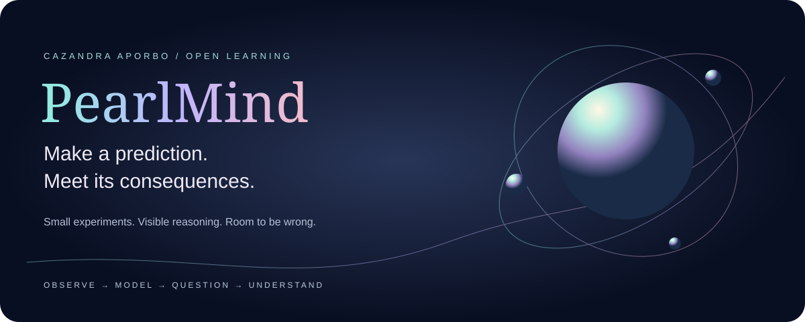
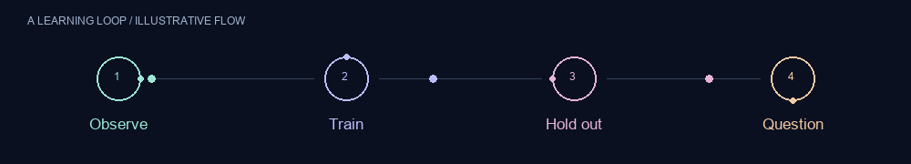

<p align="center"><a href="https://cazzy-aporbo.github.io/PearlMind-ML-Journey/"></a></p>

<p align="center">
<a href="https://github.com/Cazzy-Aporbo/PearlMind-ML-Journey/actions/workflows/ci.yml"></a>
<a href="https://cazzy-aporbo.github.io/PearlMind-ML-Journey/">Enter the learning room ↗</a> · <a href="docs/LEARNING_GUIDE.md">Follow a lesson</a> · <a href="docs/READINESS.md">Know the limits</a>
</p>

# A model is an argument. Give it something to answer for.

I’m Cazandra Aporbo. PearlMind is where I work through machine learning in public: the arithmetic, the code, the awkward results, and the decisions a score cannot make for us. It is also part of the learning behind my work at [](https://github.com/loopchii).

Start with a small question. Make your prediction before running the code. Then inspect what changed. The aim is not to collect model names; it is to understand enough to notice when a model is answering the wrong question.

**No API key, subscription or GPU is needed for the core lessons.** The browser experiments run locally in your browser. Python experiments use synthetic data and retain their results on your machine.

[](https://cazzy-aporbo.github.io/PearlMind-ML-Journey/#experiments)

## Find your way in

| Your question | Try this | What leaves the experiment |
| :-- | :-- | :-- |
| How does a model learn from being wrong? | [Gradient playground](https://cazzy-aporbo.github.io/PearlMind-ML-Journey/#gradient) → [linear regression](Learning/01_linear_regression.py) | A slope, a loss, a reason to change your step size |
| Can I train something and use it again? | [Tabular experiment](src/pearlmind/lessons/tabular.py) | JSON model, held-out predictions, feature importance and group metrics |
| What does PyTorch actually do? | [80-step CPU lab](src/pearlmind/lessons/torch_lab.py) → [tensor walkthrough](docs/LEARNING_GUIDE.md#2-a-neural-network-you-can-account-for) | Weights, preprocessing, loss curve and test accuracy |
| How does text become a next-token prediction? | [LSTM ↔ causal convolution](Learning/cnn_rnn_api_demo/Readme.md) | Local checkpoint, vocabulary, validation loss and generated text |
| When does a good score conceal a bad decision? | [Threshold desk](https://cazzy-aporbo.github.io/PearlMind-ML-Journey/#threshold) → [audit code](src/pearlmind/evaluation/fairness.py) | Confusion matrix, denominators and questions about error costs |
| What changes when work is distributed? | [Weighted gradients and bounded tools](src/pearlmind/lessons/systems.py) | A reproducible arithmetic comparison and explicit decision traces |

The [source atlas](https://cazzy-aporbo.github.io/PearlMind-ML-Journey/#atlas) connects files, imports and definitions. It distinguishes tested paths from extended studies and references. The [original model atlas](docs/original-model-atlas.md) remains available, including its earlier ambitions; it is not the installation guide.

## One experiment, end to end

Python 3.11 or 3.12 is the easiest starting point. From a fresh clone:

```bash
python -m venv .venv
source .venv/bin/activate  # Windows: .venv\Scripts\activate
python -m pip install -e ".[ci,api,learning]"
pearlmind train configs/default.yaml --output outputs/tabular
python -m pearlmind.lessons.torch_lab --epochs 80
python -m pearlmind.lessons.systems
pytest
```

Read `outputs/tabular/metrics.json` beside `predictions.csv`. Accuracy is recomputed from held-out labels, not copied into the interface. On your own data, use `--data path/to/data.csv --target target`; features must be finite numbers and this lesson’s target must be 0 or 1. A `group` column is reserved for evaluation and is not a feature.

```bash
pearlmind serve outputs/tabular/model --host 127.0.0.1
# In a second terminal:
curl http://127.0.0.1:8000/predict \
  -H 'Content-Type: application/json' \
  -d '{"features":[[0,0,0,0,0,0,0,0]]}'
```

The response contains a prediction and class probabilities. The eight zeros are a **shape demonstration**, not a meaningful real-world observation. An audit needs actual outcomes and group labels; predictions cannot certify themselves.

[Open in Codespaces](https://codespaces.new/Cazzy-Aporbo/PearlMind-ML-Journey) · [Local setup and troubleshooting](docs/SETUP.md) · [Input/output contracts](docs/CONTRACTS.md)

## Follow the evidence, including the inconvenient bits

- The tree experiment keeps a held-out split; the neural lesson fits its scaler on training rows only.
- The text lab splits raw text **before** making overlapping windows. Otherwise nearly identical passages can appear on both sides of an evaluation.
- Group metrics retain `null` when a denominator is absent. “Unknown” is more useful than a reassuring invented zero.
- A systems lesson shows when sample-weighted worker gradients equal a full-batch gradient—and why averaging workers equally can be wrong.
- CI runs tests, CPU experiments, a wheel installation, source checks and a link-checked Pages build. Download its evidence artifact to inspect outputs from that commit.

The [health-sequence study](programs/delphi-2m/README.md) also exposes its synthetic tensor checks. Its comparison reports measured shapes and parameter counts; projected clinical gains are not treated as findings.

These are educational experiments. They do not establish medical effectiveness, compliance, secure deployment or performance on unseen real-world populations. [Read the model and readiness notes](docs/READINESS.md) before adapting them.

## A useful way to teach this

Ask learners to explain the input before naming the algorithm. Predict one outcome. Run a small example. Change one assumption. End by asking who would notice if the answer were wrong.

The [teaching guide](docs/LEARNING_GUIDE.md) includes a plain-language entrance, a builder’s path and deeper mathematical questions. Teachers can use the browser desks without accounts; more experienced learners can inspect the tensor operations, tests and failure cases.

## Keep the conversation open

A small counterexample is a welcome contribution. So is a clearer explanation, a failing test, or an accessibility improvement. [Contribution guide](CONTRIBUTING.md) · [Report a problem](https://github.com/Cazzy-Aporbo/PearlMind-ML-Journey/issues/new/choose)

[Meet Cazandra](https://github.com/Cazzy-Aporbo) → [Explore the research & innovation studio](https://github.com/loopchii) → [Research, software and design](https://www.loopchii.com/)

<sub>MIT-licensed project code. External datasets and referenced work retain their own terms.</sub>
